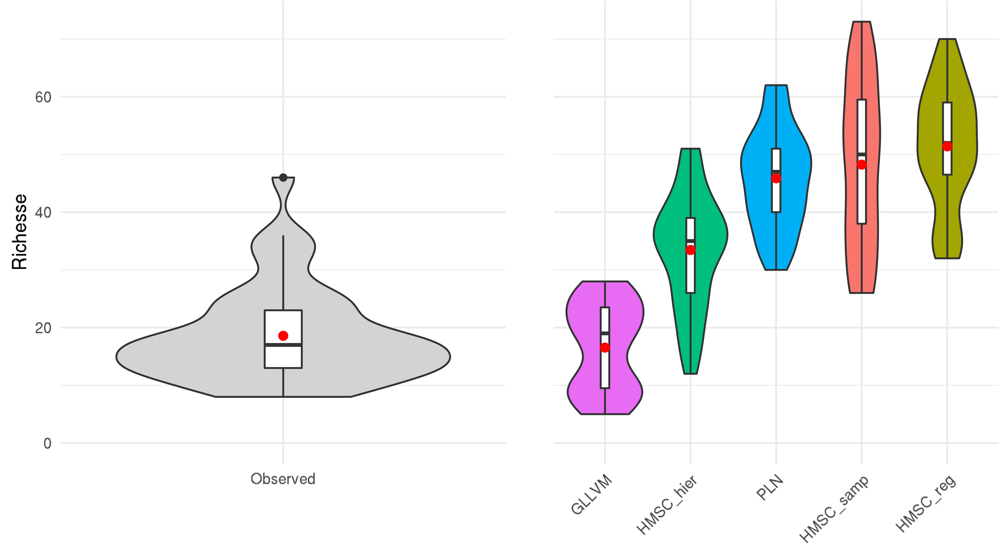
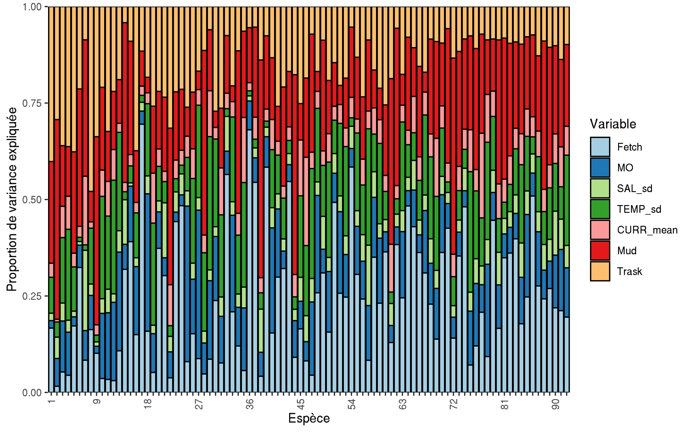
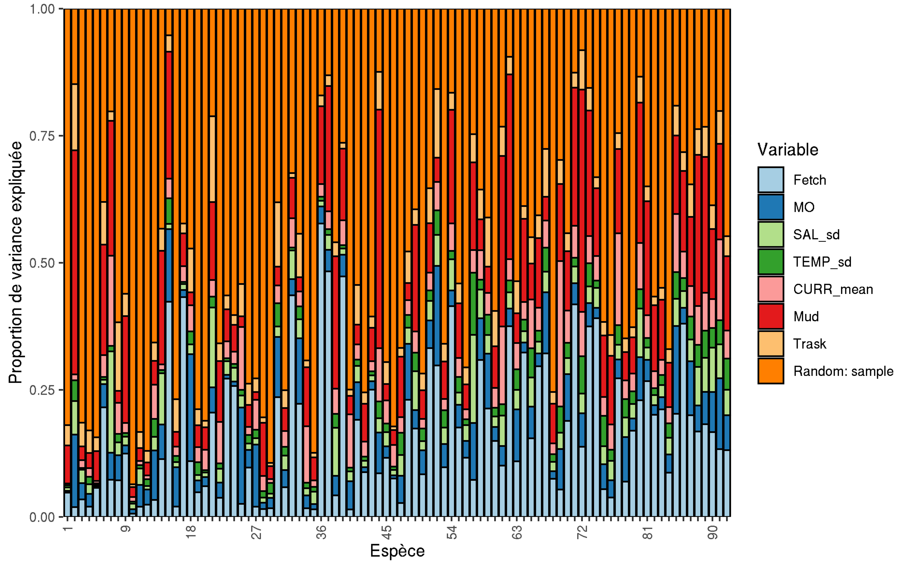
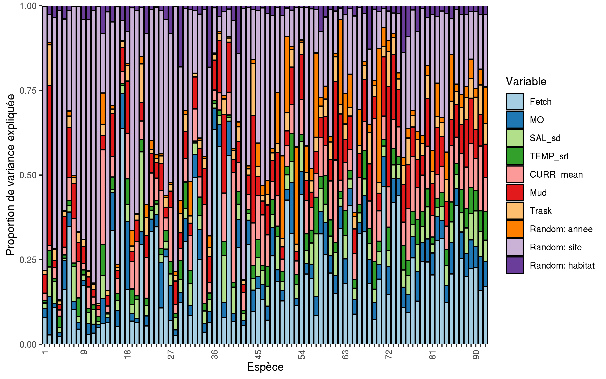

# Introduction

L'écologie moderne s'intéresse particulièrement à la répartition des espèces sur la surface du globe [@Worm_2018] et à la réorganisation de la biodiversité face aux changements environnementaux en cours [@Magurran_2019; @Blowes_2019]. Une multitude d'approches théoriques et empiriques a ainsi été développée pour comprendre les facteurs qui gouvernent la biogéographie des espèces et prédire les patrons spatiaux et temporels de biodiversités.

La capacité de persistance d'une espèce peut être définie grâce au concept de niche écologique tel que proposé par Hutchinson [@Hutchinson_1957]. Ainsi, la niche d'une espèce est représentée selon un hypervolume à n-dimemensions où chaque dimension correspond à une ressource ou une condition environnementale [@Blonder_2017] et permet de décrire les besoins ou la gamme de tolérance physiologique des organismes [@Sunday_2012]. Cette niche de Hutchinson peut être divisée en deux niches : (1) la niche de Grinnell qui s'intéresse plus particulièrement aux contraintes liées aux conditions abiotiques et caractérise la niche fondamentale de l'espèce [@Grinnell_1917]; (2) La niche d'Elton qui se focalise, principalement sur les interactions biotiques entre les individus [@Elton_2001]. En considérant le rôle des interactions biotiques en complément des contraintes environnementales, la niche d'Elton permet de décrire la niche réalisée des espèces, qui est en réalité celle observée *in situ*.

Une des manières d'avoir accès à la niche environnementale d'une espèce passe par l'expérimentation afin de délimiter des gammes et seuils de tolérances physiologiques des organismes [@Bates_2020]. Néanmoins, pour des contraintes pratiques, ces expériences peuvent difficilement prendre en compte les effets combinés de plusieurs facteurs abiotiques, et se concentrent souvent sur une seule voire deux variables environnementales (par exemple la température et la disponibilité en nourriture, ou encore le pH pour les études marines ciblées sur les changements en cours dans l'océan [@Boyd_2000; @Witman_2015]). Par ailleurs, ces expérimentations en mésocosme concernent principalement des fines échelles spatiales, temporelles et écologiques (*i.e* échelle de l'individu plutôt que de la population ou de la communauté [@Witman_2015]). Ainsi, l'échelle de ces études expérimentales ne permet pas d'appréhender pleinement l'ensemble des phénomènes écologiques structurant à l'échelle de tout un écosystème [@Leibold_2018]. Dans un contexte de changements globaux rapides induits par l'Homme, il est nécessaire d'accéder à des échelles spatiales, temporelles et écologiques plus larges [@Witman_2015; @Estes_2018], qui soit plus en lien avec les échelles auxquelles la société bénéficie, gère et affecte les écosystèmes [@Isbell_2017]. La modélisation écologique et notamment les modèles de distribution d'espèces, fournissent un outil privilégié pour cela [@Edgar_2016].

## Prédire la distribution d'une espèce

Parmi les approches permettant d'étudier la répartition spatiale d’espèces, les modèles de distributions d'espèces (*Species Distribution Models* ; *SDM*) constituent sans conteste l'un des outils les plus utilisés sur ces vingt dernières années [@Melo_Merino_2020; @Guisan_2017]. Les *SDM* reposent sur l'utilisation de variables environnementales pour expliquer et prédire la répartition des espèces, la niche de Grinnel constituant "la colonne vertébrale des modèles de distribution d'espèce" [@Gravel_2018].

La première implémentation de *SDM* est apparue à la fin des années 80 avec la méthode *BIOCLIM* [@Busby_1991]. Le développement de ce type d'approche de modélisation a notamment été favorisé par les progrès informatiques qui les rendent faciles à mettre en oeuvre [@Ovaskainen_2020; @Araujo_2019]. Ainsi, des *SDM* ont utilisé des modèles linéaires généralisés [@Hastie_1992], des modèles linéaires additifs [@Wood_2011], ou bien encore plus récemment des modèles de machine learning basée sur des arbres [@Elith_2008][^1]. Ces modèles permettent uniquement de modéliser la distribution d'une seule espèce à la fois, ils sont qualifiés de *Single-species Distribution Model*.

[^1]: Un tableau listant quelques une des méthodes de *SDM* actuellement utilisées sont disponible dans le +@tbl:sdm en annexe.

De plus, si ces méthodes permettent de caractériser la niche potentielle des espèces, la niche réalisée et notamment l'aspect eltonien de la niche des espèces reste plus difficile à appréhender [@Dehling_2018; @Hortal_2015]. Comprendre le rôle des interactions biotiques dans la distribution des espèces est souvent un facteur limitant nos capacités à prédire les patrons spatiaux de biodiversité. 

## Prédire la distribution et les dynamiques des assemblages d'espèces

Si la question de recherche s'intéresse à la communauté dans son entièreté, il existe deux stratégies différentes pour modéliser la distribution de multiples espèces. Il est possible de prédire la distribution des espèces indépendamment et de les assembler en communauté ensuite (*Stack Species Distribution Model* ou *SSDM*), ou bien de  prédire la distribution des espèces  conjointement (*Joint Species Distribution Model*) [@Ferrier_2006]. 

A l'inverse de l'approche climatologique largement appliquée dans le cas des *SDM* ou des *SSDM* qui vise à caractériser la répartition biogéographique des espèces, en ne considérant que très rarement les dynamiques temporelles de manières explicites, les *JSDM* ont pour objectif de caractériser et de prédire la variabilité spatio-temporelle des communautés. Ils permettent par ailleurs d’intégrer des informations spécifiques additionnelles afin de tirer profit des similitudes entre espèces à l’échelle de la communauté, notamment via les traits fonctionnels ou encore la phylogénie (+@tbl:jsdm). 

De plus, les *SSDM*, en combinant des modèles faits indépendamment pour chaque espèce, ne tiennent pas compte du filtre biotique que les espèces exercent les unes sur les autres et négligent donc l’aspect eltonien de leur niche [@Zurell_2019]. Au contraire, les *JSDM* ont été développés en prenant en compte les patrons de co-occurrence à l’échelle d’une communauté afin de modéliser conjointement la distribution de chaque espèce au sein de toute la communauté en tenant compte des filtres abiotiques [@warton2015]. Cette structure de co-occurrence fournit alors des informations potentielles sur les interactions entre espèces [@Ovaskainen_2017b].

|              *Joint species distribution model*           | Effets spatiaux  |  Effets temporels | Traits fonctionnels | Phylogénie  |     Référence     |
| :-------------------------------------------------------- | :--------------- | :---------------- | :------------------ | :---------- | :---------------- |
| *Bayesian ordination and regression analysis* (*BORAL*)   |     Implicite    |  Implicite        |         Oui         |    Non      | @Hui_2016         |
| *Hierachical modelling of Species Communities* (*HMSC*)   |     Explicite    |  Explicite        |         Oui         |    Oui      | @Ovaskainen_2017a |
| *Generalized linear latent variable models* (*GLLVM*)     |     Implicite    |  Implicite        |         Oui         |    Non      | @Niku_2019        |
| *Poisson lognormal model* (*PLN*)                         |     Implicite    |  Implicite        |         Non         |    Non      | @Chiquet_2019     |
Table: Quelques uns des modèles de *JSDM* et leurs fonctionnalités (adapté de @Ovaskainen_2020). Les colonnes "traits fonctionnels" et "phylogénie" indiquent si les modèles prennent en compte ces données de façon explicite. {#tbl:jsdm}

## Comprendre le rôle des interactions biotiques

Bien que le rôle des interactions biotiques dans la structure des communautés et la coexistence des espèces est depuis longtemps reconnu [@Paine_1966; @Hardin_1960], leur influence à larges échelles a pendant longtemps été négligée. Ainsi, l’explication des patrons biogéographique de diversité s’est concentrée sur le rôle des filtres abiotiques [@Tittensor_2010; @Soininen_2014].La contribution des interactions biotiques aux patrons de biodiversité à larges échelles est à ce jour mal appréhendée [@Wisz_2012]. Leur importance est néanmoins variable dans le temps, dans l’espace et selon les systèmes biologiques [@Leibold_2018]. Par exemple,  la compétition pour l’espace et la prédation sont localement des facteurs extrêmement structurants pour les communautés benthiques des estrans rocheux. La compétition entre les balanes et les moules est un exemple classique en écologie intertidale de compétition pour le substrat [@Hawkins_2019]. De même, le rôle de la prédation des étoiles de mer sur les balanes et sur les moules est à l’origine du concept d’espèce « clé de voute » [@Paine_1966]. A contrario, les plages de sable sont moins structurées par les interactions que les estrans rocheux et sont généralement plus structurées par les forces hydrodynamiques et autres facteurs abiotiques [@Defeo_2005; @Woodin_2019]. Clarifier le rôle relatif des interactions biotiques par rapport aux filtres environnementaux dans différents systèmes et à différentes échelles paraît alors primordial.

Observer et quantifier les interactions dans les écosystèmes marins est une tâche difficile. Pour les écosystèmes pélagiques, il est possible d’utiliser différentes techniques comme l’observation directe, l’étude des contenus stomacaux ou bien l’analyse isotopique d’acides gras [@Majdi_2018].  Lorsque ces méthodes sont difficiles à mettre en place, comme c'est le cas pour les écosystèmes benthiques aux larges échelles qui nous intéressent ici, @Majdi_2018 proposent d'utiliser des méthodes d'inférences statistiques. Ainsi, les *JSDM* peuvent être des outils intéressants pour mieux comprendre les interactions biotiques des écosystèmes intertidaux benthiques.

## Objectifs scientifiques

Différentes implémentations de ces modèles conjoints de distribution d’espèces (+@tbl:jsdm) ont vu le jour ces dernières années sous l’influence forte de théorie issue de l’écologie végétale concernant le rôle des interactions dans la structuration des communautés de plantes à larges échelles spatiales et temporelles [@warton2015]. De récents travaux se sont intéressés à comparer certaines de ces méthodes. @Norberg_2020 ont comparé trente-trois modèles de distributions d’espèces sur des jeux de données de présence/absence de communautés végétales. @Momal_2020 quant à eux ont comparé la capacité de reconstruction de réseaux d’interaction à partir de résultats de modèles *JSDM* entrainés sur des données d’abondance d’une communauté de poissons et sur des données de métabarcoding issu d’une communauté fongique. @Niku_2019 quant à eux présentaient le *JSDM* qu’ils ont développé, et son application à une commutée de fourmis.

Le but global de ce travail est d’explorer le potentiel de différentes méthodes de *JSDM* pour expliquer et prédire la diversité benthique. Ainsi, ce travail vise à exploiter 8 ans de données de suivi côtier (programme *REBENT*; [www.rebent.fr](http://www.sb-roscoff.fr/fr/observation/programmes/rebent-suivi-stationnel-des-sables-sublittoraux)) afin de caractériser l’influence des processus biotiques et abiotiques dans la variabilité des communautés de macrofaune benthique. En effet, la structure des *JSDM* nous permet de quantifier l’influence des facteurs abiotiques sur les patrons spatiotemporels de biodiversité benthique et d’appréhender les interactions biotiques à l’échelle de la communauté. Pour ce faire, nous allons nous concentrer sur trois implémentations différentes des JSDM : l’un des meilleurs cadres de modélisation décrits par  @Norberg_2020 (*HMSC* pour *Hierarchical Modelling of Species Community*), celui utilisé par @Momal_2020 (*PLN* pour *Poisson Lognormal Model*) ) et celui développé par @Niku_2019 (*GLLVM* pour *Generalised Linear Latent Variable Model*). L'application de ces trois méthodes sur les mêmes données d'abondance faunistiques permettra par la même occasion de comparer la performance de ces modèles, puisqu’à notre connaissance aucune étude n'a comparé ces trois méthodes lorsqu'elles sont appliquées aux écosystèmes benthiques. L’innovation de cette étude est donc double : effectuer la première comparaison simultanée de ces trois modèles, et effectuer une des premières approches de *JSDM* sur de la faune benthique inféodée aux habitats meubles.

# Matériel et méthode

## Cas d'étude

### Jeu de données

Le jeu de donnée utilisé dans ce travail est issu du *REseau de surveillance BENthique*. Ce réseau de surveillance a été créé en 1999 à la suite du naufrage du pétrolier Erika. Le but de ce réseau est d'acquérir des connaissances sur les habitats benthiques côtiers et de détecter des changements de la diversité biologique de ces habitats [@Rebent2016]. Le protocole de suivis se concentre sur la macrofaune (> 1mm) et la méthodologie détaillée est présentée dans @Boye_2019a. Seulement deux de ces habitats ont été retenus pour comparer les trois méthodes de modélisations : les herbiers de zostères et les sédiments meubles nus.

Les zostères sont des phanérogames marines qui lorsque leur densité est forte, créent des "herbiers". En Bretagne, il existe deux espèces de zostères : la zostère marine (*Zostera marina*) et la zostère naine (*Zostera noltii*). Ces herbiers forment des habitats pour de nombreuses espèces. Ils ont un rôle fonctionnel important pour beaucoup d'espèces en tant que zone de nurserie, de reproduction et de nourrissage [@Lefcheck_2019; @McDevitt_Irwin_2016]. Cet habitat est connu pour sa plus grande richesse spécifique par rapport à d'autres habitats comme les sédiments meublent nus [@Hily_1999; @Boye_2017; @Sunday_2016]. Le suivi du *REBENT* se concentre sur les herbiers de *Z. marina*, car cette espèce fait déjà partie du livre rouge des espèces menacées [@Rebent2016; @Waycott_2009]. Toutefois, les mesures de protections mises en place vis-vis de cet habitat semblent porter leurs fruits en Europe [@de_los_Santos_2019].

Les plages de sable abritent des communautés dominées par les crustacés les mollusques et les polychètes [@Defeo_2005]. Cet habitat est contraint principalement par trois facteurs abiotiques : les marées, la houle et le sédiment. L'interaction entre ces trois facteurs crée un grand éventail de plages différentes : de la plage où la mer ne se retire que très peu à marée basse aux plages dont de vastes étendues de sable sont découvertes lors des grandes marées [@Defeo_2005]. La richesse spécifique sur ces plages est fortement influée par la hauteur des marées et dans une moindre mesure par la température de l'eau et la taille des sédiments [@Defeo_2013; @Defeo_2017].  Ces plages de sable fin ont aussi un rôle écologique important de nurserie pour de nombreuses espèces de poissons plats [@Quillien_2017]. Toutefois, les plages de sable sont des biocénoses menacées. Ce sont des habitats à la fois menacés par les changements globaux (hausse du niveau des mers, érosion...) et par les activités anthropiques telles que l'urbanisme ou bien les activités récréatives [@Defeo_2009].

### Communauté faunistique

Ce travail se concentre sur les assemblages de polychètes,du phylum des annélides [@Lecointre_2001]. Cette classe a été choisie, car composée de taxons aux modes de vie très divers, dont l’écologie a déjà fait l’objet d’un travail approfondi [@Boye_2019a]. Il est classique de catégoriser les polychètes en plusieurs groupes en fonction de leurs modes de vie : certains sont nageurs, ou tubicoles, ou bien encore benthiques fouisseurs. Leurs régimes alimentaires sont aussi très variés, il existe des polychètes prédateurs, mais également des brouteurs, des suspensivores ou psamivores [@Jumars_2015]. Toutefois, la taxonomie et l'écologie de ces animaux restent assez mal connues par la communauté scientifique [@Troudet_2017]. En particulier, les interactions écologiques (compétition pour l’espace ou la nourriture, voire prédation) au sein de ces communautés de polychètes laissent largement méconnues.

## Emprise spatiale et temporelle de l'étude

Vingt-trois sites le long de la façade bretonne ont été retenus, représentant 215 échantillons collectés sur une période s'étalant entre 2006 et 2014. . Les données considérées contiennent 96 taxa différents de polychètes (et le jeu de données d’apprentissage ne contient toutefois que 92 taxa en raison de l’exclusion des 3 sites de validation). Il est important de noter que certains sites présentent deux habitats (*i.e.* herbiers, sédiments nus) associés aux mêmes conditions environnementales (étant donné la faible résolution spatiale des variables environnementales). Afin de tester la performance des modèles, vingt sites ont été retenus pour l’entraînement des différents modèles et trois pour la validation croisée (fig. @fig:sitemap). 

{#fig:sitemap}

### Données environnementales 

Six variables environnementales, collectées lors de travaux précédents sur ces communautés [@Boye_2019a] ont été sélectionnées pour expliquer la variabilité de ces communautés (tableau : {@tbl:env}). La salinité, la température et la vitesse des courants proviennent de la base de données publique *PREVIMER* basée sur les résultats des modèles de *MARS3D*. Le fetch a été calculé à partir des polygones terrestres disponibles dans *OpenStreetMap*. Les variables granulométriques ont été échantillonnées *in situ* (protocole détaillé dans @Boye_2017). Il est important de noter que, dans le but d’utiliser des polynômes pour modéliser des relations non linéaires, l’ensemble des variables explicatives ont été centrées et transformées via la fonction poly. Cependant, étant donné le grand nombre d’échantillons, nous avons été contraints d’utiliser des polynômes de degré un, ce qui revient à modéliser une simple relation linéaire, afin de réduire le temps de calcul.

|  Abréviation  |     Définition                             |    Unité    |
| :------------ | :----------------------------------------- | :---------- |
|   Fetch       |    Fetch moyen                             |     Km      |  
|   MO          |   Concentration en Matière organique       |   %         |
|   SAL_sd      | Ecart-type de la salinité de l'eau         | PSS-78      |
|   TEMP_sd     | Ecart-type de la température de l'eau      | °C          |
|   CURR_mean   | Force moyenne des courants                 | m.s^-1^     |
|   Mud         | Concentration de boue dans les sédiments   | %           |
|   Trask_So    | Indice de Trask - Homogénéité du sédiment  | Aucune      |
Table: Variables environnementales utilisées dans l'ensemble des modèles. {#tbl:env}

## Modèle de distribution d'espèces conjointes (*JSDM*)

Bien que chaque implémentation des *JSDM* soit différente et permettent de prendre en compte différents types de données (+@tbl:jsdm), ces modèles sont tous des extensions multivariées à variables latentes des modèles linéaires généralisés classiques [@Hui_2016 ; @Ovaskainen_2017a; @Niku_2019; @Chiquet_2019]. Un modèle à variables latentes (*LVM*) avec une variable explicative peut être écrit comme suit[^2] :

$$ y_{ij} = g\left(x_{i} \times \beta_j + Z_{i.} \times \lambda_{j.}\right) $${#eq:lvm} 

[^2]: L'ensemble des notations mathématiques sont présentées dans le glossaire.

Avec $y_{ij}$ représentant l'abondance prédite de l'espèce $j$ au site $i$. $g(.)$ une fonction de lien ; $x_i$ le vecteur de la variable environnementale au site $i$, $\beta_j$ le coefficient de l'effet environnemental associé pour l'espèce $j$. Enfin, avec $Z_i.$ est la matrice de variable latente associée aux sites et et qui joue le rôle des prédicteurs manquants et $\lambda_j$ la matrice de poids associés à l'espèce $j$ qui donnent une estimation des corrélations résiduelles entre espèces $\Omega$, avec [@warton2015] :

$$\left(Z_i \times \lambda_j\right) \sim \mathcal{N}\left(0, \Omega\right)$$ {#eq:lvmconst}

Outre la prise en compte via les variables latentes d'éventuelles variables explicatives manquantes et des corrélations résiduelles entre espèces. L'avantage majeur des *LVM* est que l'estimation de matrice de corrélation entre espèces est plus simple que par rapport à un modèle linéaire à effets mixtes généralisés. La matrice de coordonnés des espèces ($\lambda$) dans le cas d'un *LVM* a au plus autant de colonnes que de variables latentes (+@eq:lvmconst). Dans le cas d'un modèle linéaire à effets mixte généralisé celle-ci à autant de colonnes que d'espèces [@warton2015]. Ainsi, le nombre de variables latentes utilisées par le modèle est donc un paramètre crucial, puisqu'il permet de faire un compromis entre précisions de la matrice de corrélation résiduelle et la réduction du temps de calcul et des degrés de liberté utilisés [@warton2015]. Trois cadres de modélisations ont été sélectionnés : *HMSC*, *GLLVM* et *PLN* et exploré cinq variantes de modèles ces modèles. L'ensemble des caractéristiques de ces variantes de modèles sont présentées dans le +@tbl:summarymod .

### *Hierachical modelling of Species Communities*

*HMSC* est un modèle mixte linéaire généralisé, hiérarchique et multivarié, ajusté par inférence bayésienne [@Ovaskainen_2020]. La particularité de ce modèle est qu'il est hiérarchique, ainsi chaque effet aléatoire donne lieu à sa propre matrice de corrélation résiduelle [@Ovaskainen_2017a] et qu'il peut s'implémenter avec une vaste gamme de distribution [@Tikhonov_2019b]. L'+@eq:hmsc présente la formulation mathématique d'un modèle n'utilisant que des variables environnementales et un nombre $n_r$ d'effets aléatoires (il serait aussi possible d’ajouter des données de traits et de phylogénie pour mieux caractériser les niches abiotiques des taxa similaires).

$$ y_{ij} = g\left(x_i \times \beta_j + \sum_{r = 1}^{n_r} Z_{ir} \times \lambda_{rj}\right) $$ {#eq:hmsc}

Etant un modèle bayésien, la distribution a posteriori est échantillonnée grâce à la méthode MCMC [@Ovaskainen_2017b]. L'utilisation de l'inférence bayésienne permet à l'utilisateur de ne pas spécifier le nombre de variables latentes à utiliser pour chaque effet aléatoire. Le modèle ajuste le nombre de variables latentes pour que celles non significatives soient tronquées [@Ovaskainen_2020].

Trois modèles *HMSC* ont été créés : un premier sans l'inclusion d'effets aléatoires (*HMSC_reg*) qui ne prend donc pas en compte les corrélations résiduelles entre espèces et l'aspect eltonien de leur niche ; un second avec un seul effet aléatoire lié à l'échantillon (*HMSC_samp*) et un dernier avec trois facteurs aléatoires liés respectivement à l'année, au site et à l'habitat. Ce dernier modèle permet ainsi de partitionner les associations résiduelles entre association temporelle, spatiale ou liée à l'habitat (sédiment nu ou herbiers). Les calculs ont été réalisés avec le package *Hmsc* [@Tikhonov_2019b; @Hmsc_2019]. Chaque modèle dispose de quatre chaînes de Markov et chaque chaîne effectue 1,5 million d'itérations avant de se stopper. L’étape de *burn-in* supprime les 500 000 premières itérations de chaque chaîne.  Les chaînes sont échantillonnées toutes les mille itérations. Les priors par défaut ont été utilisés. Avant de regarder les résultats des différents modèles du framework *HMSC*, la validité de ces modèles a été inspectée. La bonne convergence des chaînes a été vérifiée à l'aide de l'outil de diagnostic de Gelman-Rubin [@Gelman_1992]. Enfin, le nombre d'échantillons indépendants pour chaque paramètre a été jugé satisfaisant (supérieur à 1000 échantillons indépendants pour l'ensemble des paramètres).

### Modèle de Poisson Lognormal

Le modèle de Poisson lognormal est linéaire mixte et multivarié. Son implémentation ne permet de modéliser qu’une seule sorte de distribution : la distribution (conditionnelle) de Poisson lognormale +@eq:pln [@Aitchison_1989; @Chiquet_2019]. Un modèle simple avec uniquement des variables environnementales peut être écrit de cette façon :

$$y_{ij}|Z_{ij} \sim \mathcal P\left(exp\left\{x_i \times \beta_j + Z_{ij}\right\}\right)$$ {#eq:pln}

Le vecteur latent $Z_i$ prend en compte les variations d'abondance non expliquées par les variables environnementales incluses dans le modèle [@Momal_2020]. Cette variable latente agit comme un effet aléatoire lié à l'échantillon [@Momal_2020]. Dans ce cadre de modélisation, il y a autant de variables latentes différentes qu'il y a d'espèces $n_s$ et chaque variable latente suit une loi normale de moyenne 0 et de variance $\Omega^{-1}$, où $\Omega$ est la matrice de corrélations résiduelles entre espèces :

$$Z_i \sim N\left(0_{n_s}, \Omega^{-1}\right) $$ {#eq:constpln}

Le modèle a été créé avec le package R *PLNmodels* [@Chiquet_2019]. Pour comparer avec les autres implémentations des JSDM testées ici, aucun terme d’offset n’a été ajouté au modèle. Les paramètres par défaut ont également été utilisés pour ajuster le modèle.

### *Generalized linear latent variable models*

*GLLVM* est un modèle mixte linéaire généralisé et multivarié ajusté par la méthode du maximum de vraisemblance qui peut être écrit par l'+@eq:lvm. Ce modèle présente une manière innovante de maximiser la vraisemblance en utilisant une approximation variationnelle gaussienne de la log-vraisemblance pour le cas où la fonction de lien serait des données de comptage surdispersé, binaires ou encore ordinales [@Niku_2019]. Cette méthode de maximisation de la log-vraisemblance permet d’accélérer les calculs. Par exemple, comparativement à une autre implémentation, *Boral* [@Hui_2016], d’un même modèle, *GLLVM* ne requiert que quelques minutes au lieu de quelques heures. En revanche, et contrairement à HMSC qui l’estime ou *PLN* qui a une valeur fixe, *GLLVM* demande à l’utilisateur de choisir le nombre de variables latentes qu’utilisera le modèle [@Gllvm_2019].

Le modèle a été créé avec le package R *gllvm* [@Niku_2019; @Gllvm_2019]. Le modèle utilise une distribution négative binomiale et vingt variables latentes.

+---------------+-----------+--------------------------+---------------------------------+------------------------------+
| Nom du modèle | Framework | Distribution statistique |    Nombre de facteur aléatoire  | Nombre de variables latentes |
+:==============+:==========+:=========================+:================================+:=============================+
| *HMSC_reg*    | *HMSC*    | Poisson lognormal        | 0                               | $0$                          |
+---------------+-----------+--------------------------+---------------------------------+------------------------------+
| *HMSC_samp*   | *HMSC*    | Poisson lognormal        | 1                               | $n_l \in \mathbb{N}^*$       |
+---------------+-----------+--------------------------+---------------------------------+------------------------------+
| *HMSC_hier*   | *HMSC*    | Poisson lognormal        | 3                               | $n_l \in \mathbb{N}^*$       |
+---------------+-----------+--------------------------+---------------------------------+------------------------------+
| *PLN*         | *PLN*     | Poisson lognormal        | 1                               | $n_l = 92$                   |
+---------------+-----------+--------------------------+---------------------------------+------------------------------+
| *GLLVM*       | *GLLVM*   | Negative binomial        | 0                               | $20$                         |
+---------------+-----------+--------------------------+---------------------------------+------------------------------+

Table: Descriptif des modèles utilisés. $^*$ Lorsque des effets aléatoires sont définis pour les modèles *HMSC*, un nombre infini de variables latentes peut être généré, seules les variables latentes importantes sont conservées (voir @Bhattacharya_2011 pour plus d'informations). {#tbl:summarymod}

## Reconstruction des réseaux d'interactions

Afin d’appréhender les processus écologiques structurant les communautés de polychètes, des réseaux d’interactions potentielles ont été reconstruits grâce au package *EMtree* à partir des matrices de corrélations résiduelles issues de chaque modèle. Le principe de l’algorithme contenu dans ce package est d’inférer des interactions entre espèces en utilisant des arbres couvrants (graphes connectant tous les noeuds sans aucune boucle). La probabilité qu’un lien fasse partie du réseau d’intérêt est égale à la somme des probabilités conditionnelles associées à chaque arbre couvrant [@Momal_2020].

## Critères de comparaison des modèles implémentés

### Pouvoir explicatif

Le pouvoir explicatif de chaque modèle pour chaque taxon est donné par une mesure de pseudo-*R^2^*, dénommé après *SR^2^*. Ainsi, pour la distribution de Poisson, *HMSC* estime le *SR^2^* comme la corrélation de Spearman entre les données d’abondance observées et prédites [@Ovaskainen_2020]. Cette mesure est calculée de la façon suivante pour l’espèce $j$ :

$$ SR^2_j = sgn\left(r_s\left(y_{.j}, \hat{y}_{.j}\right)\right) \times r_s\left(y_{.j}, \hat{y}_{.j}\right)^2 $$ {#eq:eq2}

Où $sgn$ est la fonction signe, $\hat{y}$ est l'abondance estimée et $r_s$ la corrélation de Spearman. Cette même mesure a été appliquée sur l’ensemble des autres modèles.

### Validation croisée

Parmi les vingt-trois sites étudiés, trois ont été utilisés pour effectuer de la validation croisée sur les modèles. Deux de ces trois sites présentent les deux habitats et le dernier présente uniquement des sédiments meubles. La performance des modèles a été comparée sur deux critères : la prédiction de l'abondance de chaque espèce et la prédiction de leur occurrence. 

#### Prédiction de l'abondance

Chaque modèle entrainé a été utilisé pour prédire l'abondance des espèces présentes dans les trois sites de validation. La qualité de la prédiction a été évaluée par la racine carrée de l'erreur quadratique moyenne (*RMSE*).

#### Prédiction de l'occurrence

Pour prédire l’occurrence de chaque espèce à partir des données d’abondance prédites par les modèles, deux approches ont été suivies. Dans un premier temps, une espèce a été considérée présente si son abondance prédite était supérieure à 0. Cependant, étant donné les incertitudes existantes autour des valeurs d’abondances prédites (cf. partie résultat sur l’abondance), il a été décidé d’établir dans un second temps un seuil limite, modèle et espèce spécifique, pour convertir les données d’abondance prédites en présence/absence, de manière analogue aux seuils définis dans les *SDM* pour convertir les cartes de probabilité de présence en carte de présence/absence [@Guisan_2017; @Ashcroft_2017]. Afin de définir ce seuil, une première étape a consisté à créer pour chaque espèce une courbe *ROC* (de l'anglais *Receiver Operating Characteristic*) basée sur le nombre de vrais et faux positifs de l’occurrence selon différents seuils d’abondance. Puis, pour chaque courbe *ROC*, le *J* de Youden a été calculé grâce à l'+@eq:youden et la valeur maximale de cet indice a donné le seuil que nous avons appliqué pour déterminer la présence prédite de chaque espèce. Le *J* de Youden a été sélectionné, car cette statistique maximise le nombre de vrais positifs et de vrais négatifs, tout en donnant le même poids aux faux positifs et faux négatifs. Sa valeur maximale est de 1, lorsqu'il n'y a pas de faux positifs ou négatifs et de 0 lorsque qu'il y a la même proportion de faux positifs et négatifs que de vrais positifs et négatifs.

$$ J = \frac{\text{vrais positifs}}{\text{vrais positifs} + \text{faux négatifs}} + \frac{\text{vrais négatifs}}{\text{vrais négatifs} + \text{faux positifs}} - 1 $$ {#eq:youden}

### Comparaison des réseaux inférés

Les réseaux reconstruits sont comparés à l’aide de métriques issues de la théorie des graphes appliquée aux réseaux probabilistes [@Poisot_2015]. Ces outils sont issus du package EcologicalNetworks.jl [@Poisot_2019]. Quatre métriques ont été sélectionnées : le nombre de liens, la connectance, la centralité de Katz et l'emboitement. Le nombre de liens et la connectance sont des propriétés fondamentales de la structure des réseaux trophiques et des réseaux d'interactions [@Martinez_1992]. Dans un réseau probabiliste, le nombre de liens est calculé grâce à la somme des probabilités sur l'ensemble du réseau ($l = \sum A_{ij}$), il ainsi possible de calculer la variance du nombre de liens ($var(l) = \sum A_{ij} (1 - A_{ij})$). Par exemple, la résistance d'un réseau écologique aux perturbations est par  proportionnelle à sa connectance. La connectance est le nombre de liens $l$ divisé par le nombre de liens possibles $(S\times(S-1)/2)$. Cette mesure comprise entre 0 et 1 peut être associée à la résistance globale d'un réseau écologique aux perturbations. La centralité de Katz permet de connaître l'importance de chaque espèce dans le réseau. L’emboitement des interactions est un indice qui traduit à quel point les interactions réalisées par les espèces spécialistes (celles impliquées dans peu d’interactions) est un sous-ensemble de celles réalisées par les espèces généralistes (impliquées dans beaucoup d’interactions). Cette mesure est comprise entre 0 et 1. Cette mesure de l'imbrication est importante pour comprendre la dynamique d'un réseau d'interaction, car l'hypothèse a été faite que des réseaux fortement imbriqués promeuvent une plus grande diversité en minimisant la compétition en particulier dans les réseaux mutualistes [@Bastolla_2009].[^3]

[^3]: Pour le calcul des différentes métriques, se référé à @Poisot_2015 et @Poisot_2019 .

Pour tous les modèles incluant au moins une variable latente (tous sauf *HMSC_reg*), un réseau a été reconstruit grâce à la matrice de corrélation résiduelle $\Omega$ . Pour la méthode *HMSC_hier*, un réseau a été reconstruit pour chaque effet aléatoire, chacun ayant sa propre matrice . Un méta-réseau a également été créé en moyennant les probabilités sur l’ensemble des méthodes. L’ensemble des différents réseaux sont représentés en annexe (+@fig:netgllvm à @fig:nethmschierhab).

### Validation par experts

Douze paires d’interactions potentielles ont été soumises au jugement d’un panel de cinq experts des polychètes. Les experts ont évalué la vraisemblance de chaque interaction sur une échelle de 0 à 4 :

0. Ces deux taxa n'interagissent pas ;

1. Ces deux taxa ne peuvent probablement pas interagir ;

2. Pas d'avis sur l'interaction de ces deux taxa ;

3. Ces deux taxa peuvent probablement interagir ;

4. Ces deux taxa interagissent.

Les experts ont effectué cette évaluation sans avoir connaissance des probabilités d’interactions inférées par les modèles. Du fait du petit nombre d’experts, les réponses ont été agrégées en trois catégories : interaction possible, interaction impossible et ne se prononce pas. La concordance de l’avis des experts a été mesurée à l’aide du $W$ de Kendall [@Legendre_2005]. Enfin, les experts ont aussi été interrogés de manière plus qualitative sur la vraisemblance des réseaux reconstruits par la méthode *EMtree*.

## Matériel informatique logiciels utilisés

Les calculs pour tous les modèles ont été réalisés par le supercalculateur de l'IFREMER DATARMOR. Le processeur de chaque noeud de calculs du cluster HPC est un CPU Intel E5-2680 v de 14 coeurs cadencés à 2,40 GHz. Chaque modèle n'utilisait pas plus d'un seul coeur. 

Les modèles ont été mis en place à l'aide du langage de programmation R 3.6.1 [@RCoreTeam_2019]. Les résultats ont été analysés conjointement grâce aux langages R [@RCoreTeam_2019] et Julia 1.2.0 [@Bezanson_2017]. 

# Résultats  

## Comparaison des performances des modèles

### Pouvoir explicatif

Les capacités explicatives des différents modèles permettent de les séparer en deux groupes distincts (+@fig:SR2). Les modèles *PLN*, *GLLVM* et *HMSC_reg* expliquent en moyenne autour de 10% de la variabilité des espèces contre 25% pour les modèles *HMSC_samp* et *HMSC_hier*. De plus, *HMSC_samp* et *HMSC_hier* expliquent jusqu’à 60 à 80% de la variation des espèces les mieux expliquées alors que les modèles *PLN*, *GLLVM* et *HMSC_reg* ne dépassent pas les 40%. Enfin, ces deux groupes de modèles diffèrent aussi dans l’identité des espèces les mieux expliquées, alors qu’entre les modèles d’un même groupe, les mêmes espèces ressortent de façon extrêmement consistante. Néanmoins, les performances de l’ensemble de ces modèles en termes de pouvoir explicatif sont à mettre en perspective du grand nombre d’espèces ayant un *SR^2^* inférieur à 0,10.

{#fig:SR2}

### Prédiction de l'occurrence et de l'abondance

La validation croisée sur trois sites tests (exclus de l’apprentissage) permet la comparaison du pouvoir prédictif des modèles en termes de richesse spécifique et d’abondance, et ce sur les 8 années de suivis de ces trois sites.

#### Abondance

Aucun modèle ne parvient à prédire de manière satisfaisante l'abondance des espèces à chaque site. Le modèle le moins mauvais est le modèle *HMSC_hier* dont la plus faible valeur de *RMSE* pour une espèce est de 24 individus et la plus forte valeur de *RMSE* est de l'ordre de $10^4$. En moyenne ce modèle présente un *RMSE* de l'ordre de $3,63\times 10^3$. Bien que cette erreur moyenne soit importante, elle est plus faible que celle des autres modèles (entre $6,53\times 10^3$ et $1,09\times 10^{36}$). Le modèle GLLVM apparaît comme le moins fiable pour estimer l'abondance, avec une erreur minimale de prédiction de l’ordre de $10^31$.

#### Occurrence

Si aucun modèle n’arrive pleinement à reproduire les richesses observées aux sites de validation et leurs dynamiques temporelles ((+@fig:predoccbrt, +@fig:predocccorr et +@fig:occpredtemp), les prédictions de l’occurrence des espèces semblent bien plus réalistes que celles concernant leur abondance.

{#fig:predoccbrt}

{#fig:predocccorr}

La richesse moyenne observée aux sites de validation est d’environ 20 espèces. Si l’on considère qu'une espèce est présente à partir du moment où son abondance prédite est supérieure à 0, *GLLVM* est le modèle dont la richesse prédite est la plus proche de celle observée, en ayant toutefois tendance à sous-estimer la richesse moyenne (+@fig:predoccbrt, +@fig:predocccorr et +@fig:occpredtemp). Cette sous-estimation est encore plus prégnante lorsqu’on utilise un seuil d’abondance adapté pour estimer l’occurrence des espèces (+@fig:occpredtemp). Au contraire, *PLN*, *GLLVM* et *HMSC_samp* surestiment la richesse des communautés avec une richesse moyenne deux fois supérieure à celle observée si l’on convertit directement l’abondance prédite des espèces en présence/absence, mais sont dans une gamme de richesse plus cohérente lorsque l’approche par seuil est utilisée. Dans les deux approches, *HMSC_hier* apparaît comme la meilleure méthode pour estimer l’occurrence des espèces et prédire la richesse des assemblages de polychètes. Sans définir de seuil spécifique de présence effective, le *RMSE* indique que l’erreur sur la prédiction de la richesse spécifique est finalement relativement faible pour l’ensemble des modèles (+@tbl:RMSEocc). Le *RMSE* médian est de 7 pour le modèle *GLLVM* et de 16 pour le modèle *HMSC_hier*. Mais ce *RMSE* *médian* est près de deux fois plus élevées pour les modèles *PLN*, *HMSC_samp* et *HMSC_reg*.

|Method      | Min|     Q1| Median|  Moy   |     Q3|   Max|
|:-----------|:---|:------|:------|:-------|:------|:-----|
|*GLLVM*     | $0$|  $3,0$|    $7$|  $7,63$| $10,0$|  $29$|
|*HMSC_hier* | $1$| $11,5$|   $16$| $15,37$| $20,0$|  $33$|
|*PLN*       | $4$| $21,0$|   $27$| $27,28$| $33,0$|  $51$|
|*HMSC_reg*  | $6$| $25,0$|   $33$| $32,84$| $40,5$|  $56$|
|*HMSC_samp* | $4$| $18,5$|   $30$| $29,65$| $38,5$|  $62$|
Table: Statistiques descriptives du *RMSE* de la richesse spécifique par modèle. Les modèles sont classés par ordre croissant de *RMSE* maximal. Q1 et Q3 représentent respectivement le premier et troisième quartile du *RMSE* de chaque modèle. {#tbl:RMSEocc}

Les modèles prédisent correctement la variabilité de la richesse inter-site en trouvant tous l'ordre de grandeur de la richesse spécifique pour chaque site (+@fig:occpredtemp). Les modèles prédisent mieux la richesse spécifique dans les herbiers que dans les plages de sable. *HMSC_hier* est le modèle qui prédit le mieux la variabilité de la richesse spécifique. Ce modèle arrive à également prédire les fluctuations temporelles, notamment la diminution de la richesse spécifique observée pour les herbiers en 2009.

{#fig:occpredtemp}

## Effets de l'environnement

Les effets des variables environnementales sur l’abondance prédite des différents taxa sont globalement similaires à travers les différents modèles (+@fig:effectenv). Dans la +@fig:effectenv les variables environnementales sont ordonnées par proportion décroissante de variances expliquée. Ainsi, des variables mesurées à l’échelle du site comme l’exposition (Fetch) ou la vitesse moyenne du courant expliquent une plus grande part de variance dans l’abondance des espèces que les variables sédimentologiques comme l’indice de Trask ou la concentration en vase mesurée à une échelle plus locale (+@fig:varpartreg à @fig:varparthier en annexe). L’analyse de cette figure par les experts benthologues a aussi mis en lumière que ces espèces étaient toutes majoritairement inféodées à des environnements de sables fins, ce qui tend à corroborer les effets positifs du Trask observés dans la majorité des modèles, sauf *HMSC_hier*. Dans l’ensemble, les facteurs aléatoires sont ceux qui expliquent le plus de la variation des espèces, notamment pour celles les mieux expliquées (Figure 1 à 3 en annexe). La façon d’implémenter ces effets aléatoires apparaît donc critique, d’autant que dans HMSC ils influencent grandement les coefficients estimés (Figure 5).

Pour tous les modèles, l’effet des variables environnementales est assez net pour les espèces les mieux expliquées (15 premières en partant du haut) et devient moins marqué quand il s’agit d’expliquer l’abondance des espèces les moins bien expliquées (espèces qui se trouvent dans le tiers inférieur de la +@fig:effectenv). De plus, tous les modèles montrent un effet positif pour la variable Trask (plus le sédiment est bien trié plus les espèces sont abondantes), à l’exception du modèle *HMSC_hier*. Avec l’inclusion des effets aléatoire sites, habitats et années, le modèle *HMSC_hier* montre à l’inverse un effet faiblement négatif, voire négatif, sur l’abondance des espèces. Le modèle *HMSC_hier* est ainsi celui qui se différencie le plus en termes de coefficients estimés, ce qui semble en lien avec la part de variance importante expliquée par l’ajout des facteurs aléatoires (+@fig:varpartreg à @fig:varparthier).

{#fig:effectenv}

## Réseaux reconstruits

### Analyse des graphes

Tous les réseaux probabilistes reconstruits présentent le même nombre de liens 182 et globalement, il y a peu de différence notable dans la structure des réseaux inférés par les différents modèles (+@tbl:metrics*). L’écart-type du nombre de liens est légèrement plus important pour les effets aléatoires année et habitat du modèle *HMSC_hier* , mais reste dans des ordres de grandeur similaires à ceux des autres modèles. La connectance , qui peut en théorie varier entre 0 et 1, est quasiment identique pour tous les modèles et apparaît extrêmement faible. L’imbrication  des réseaux est aussi quasi nulle et similaire sur l’ensemble des modèles.  

| Méthode            | $\sigma_l$ |  $C$      |  $\eta$   |
|:-------------------|:---------- |:----------|----------:|
|*HMSC_samp*         | $12,70$    |   $0,022$ | $0,03$    |
|*HMSC_hier_annee*   | $13,10$    |   $0,021$ | $0,03$    |
|*HMSC_hier_site*    | $12,46$    |   $0,021$ | $0,03$    |
|*HMSC_hier_habitat* | $13,11$    |   $0,021$ | $0,03$    |
|*GLLVM*             | $12,51$    |   $0,021$ | $0.04$    |
|*PLN*               | $12,60$    |   $0,022$ | $0.04$    |
Table: Métrique des réseaux d'interactions reconstruits. $\sigma_l$ représente l'écart-type du nombre de liens. $C$, Connectance. $\eta$, imbrication des réseaux trophiques. {#tbl:metrics}

Le réseau moyen reconstruit sur la base des corrélations résiduelles entre taxons met en évidence un nombre restreint d’interactions fortement probables (+@fig:meannet) en corroborant les faibles connectances estimées sur les réseaux individuels (+@tbl:metrics). Ainsi, beaucoup d’espèces ne semblent pas avoir de liens dans le réseau, avec une majorité des interactions inférées ayant une probabilité inférieure ou égale à $0,2$.

![Réseau inféré moyen qui présente des probabilités d’interaction moyennées sur l’ensemble des réseaux reconstruits décrits dans le Tableau 2 . Les points rouges représentent les taxa de polychètes retrouvés dans les deux habitats, les verts ceux retrouvés uniquement dans les herbiers et les bleus ceux présents seulement dans les sédiments meubles. Seules les arrêtes ayant une probabilité supérieure à $0,2$ sont affichées. L’opacité des arrêtes est proportionnelle à leur importance dans le réseau (mesurée par la centralité de Katz)](figures/mean-network-1.png){#fig:meannet}

Plusieurs réseaux d’interactions peuvent être dérivés de *HMSC*,  une association résiduelle pouvant être extraite pour chacun des facteurs aléatoires inclus dans le modèle. La Figure 6 présente par exemple le réseau reconstruit sur la base des corrélations résiduelles associées au facteur aléatoire temporel (années). Il est intéressant de noter que seules des corrélations positives entre espèces sont présentes dans ce réseau alors que les réseaux liés aux facteurs sites ou habitats, ou que les réseaux issus des autres modèlent incluent aussi des corrélations négatives (+@fig:nethmschiersite et @fig:nethmschierhab en annexe).

![Réseau reconstruit avec EMTree sur la base des corrélations résiduelles associées à l’effet aléatoire temporelle du modèle *HMSC_hier*. Les points rouges représentent les taxa de polychètes retrouvés dans les deux habitats, les verts retrouvés uniquement dans les herbiers et les bleus dans les sédiments meubles. Seules les arrêtes ayant une probabilité supérieure à $0,2$ sont affichées. L’opacité des arrêtes est proportionnelle à leur probabilité. L’opacité des points est proportionnelle à leur importance dans le réseau.](figures/hmsc-hier-annee-network-1.png){#fig:hmschierannee}

### Avis des experts du taxon des polychètes

L’analyse de concordance de Kendall montre qu’il n’y a pas de consensus significatif entre les différents experts quant à la probabilité d’interaction entre les espèces qui leur ont été soumises ($W + 0,26$, $p > 0,2$). Résumer ces notes attribuées par les experts en deux catégories seulement (interaction possible ou impossible), ne modifie pas cet absence de consensus entre les experts ($W = 0,2$, $p > 0,44$). Cette absence de concordance entre experts rend difficile la validation des interactions inférées par les modèles, mais il semble que les probabilités d’interactions prédites ne correspondent pas à la vision globale des experts (+@fig:expert). En effet, les interactions prédites sur l’ensemble des modèles comme étant les plus probables sont plus souvent qualifiées d’impossible par les experts que de potentiellement possible. Pour certaines interactions, il faut cependant noter que l’avis des experts était unanime, et il a ainsi été possible d’interpréter qualitativement le sens de certaines interactions prédites via des discussions directes avec certains experts.

{#fig:expert}

## Coût de calcul

Chaque modèle présente des caractéristiques propres en termes de coup de calcul (+@tbl:coutcalc). Les modèles implémentés sous *HMSC* présentent les temps de calcul les plus longs, mais leur coût en mémoire vive reste cependant faible. Le temps de calcul augmente considérablement avec le nombre d’effets aléatoires passant de plus de 25h pour le modèle le plus simple (sans effet aléatoire) à près de 458h pour le modèle le plus complexe (trois effets aléatoires indépendants). Comme attendu, *GLLVM* se révèle être une implémentation particulièrement rapide, étant même plus rapide à ajuster que le modèle sans effet aléatoire *HMSC_reg*. Toutefois, sa vitesse est largement contrebalancée par le coût important en mémoire vive. Ce modèle a nécessité plus de 68 Go de RAM pour pouvoir être ajusté. *PLN* quant à lui est le modèle le plus économe à ajuster, il n’a besoin que de trois minutes et moins de 500 Mo de RAM pour être ajusté.

|     Modèle     |   Temps de calcul (h : mn)   |      RAM (Go)    |
| :------------- | :--------------------------: | :--------------: |
| *HMSC_reg*     | $25:27$                      | $0,49$           |
| *HMSC_samp*    | $170:56$                     | $0,69$           |
| *HMSC_hier*    | $457:50$                     | $0,73$           |
| *PLN*          | $00:03$                      | $0,37$           |
| *GLLVM*        | $13:43$                      | $68,1$           |

Table: Coût de calculs des différents modèles. {#tbl:coutcalc}

# Discussion

## Comprendre et prédire la diversité benthique

Les différents modèles présentés ici n’expliquent que partiellement la variabilité des assemblages de polychètes. Ainsi, sur les 92 espèces du jeu données d’apprentissage, seules quelques espèces comme *Notomastus latericeus* (n°1), *Euclymene spp.*, *Lumbrineris spp.* (n°3), *Nephtys cirrosa* (n°2) ou bien *Owenia fusiformis* (n°7) sont convenablement expliqués par les modèles.[^4]

[^4]: Les numéros correspondent aux entrées dans le +@tbl:sp .

Les modèles tels que *HMSC_hier* et *HMSC_samp* semblent tirer parti de leur structure hiérarchique pour expliquer convenablement un plus grand nombre d’espèces par rapport aux modèles ne disposant pas d’une telle structure. En effet, ce sont principalement les effets aléatoires qui expliquent le plus de la variation des espèces. Ainsi, le manque de pouvoir explicatif des variables environnementales semble montrer que la niche écologique des espèces de cette communauté est mal définie dans nos modèles. Les variables environnementales sélectionnées ne sont probablement pas mesurées à la bonne échelle, ou leur effet ne peut être distingué correctement des effets spatiaux. Ce manque de pouvoir explicatif des variables environnementales limite la transférabilité de ces modèles à d'autres lieux et environnements.

Nos modèles prédisent relativement bien l’occurrence des espèces et donc la richesse des assemblages et leurs variations dans l’espace et le temps. Ces résultats sont consistants avec les précédentes comparaisons qui ont été faites de ces modèles [@Norberg_2020; @Momal_2020]. Notamment, la richesse des assemblages est apparue particulièrement bien prédite lorsque des seuils espèce-spécifique ont été utilisés pour convertir l’abondance en présence/absence [@Ashcroft_2017]. L’utilisation de cette approche par seuil, largement inspirée des approches de cartographie à partir de *SDM* [@Lawson_2013], est inédite à notre connaissance pour l’analyse des prédictions issues de *JSDM*. Une comparaison des performances de cette approche (modélisation de l’abondance puis seuils pour convertir en occurrence) avec de modèles entrainés directement sur des données d’occurrence (ce qui était fait jusqu’à présent, e.g ; @Norberg_2020) pourrait permettre d’évaluer plus clairement la validité de l’approche. Cependant, il nous semble potentiellement plus prometteur de prendre en compte l’information contenue dans l’abondance des espèces pour entrainer les modèles puis d’utiliser des seuils appropriés pour modéliser la richesse des communautés, que d’utiliser une transformation brute des abondances en présence/absence, ou encore que de négliger complètement l’information contenue dans l’abondance des espèces. Cependant, si l’une des promesses des *JSDM* est bien de pouvoir prédire également l’abondance des espèces, la performance des modèles testés ici est apparue décevante. Le *RMSE* maximal pour le meilleur modèle, *HMSC_reg*, est ainsi de l’ordre de $10^4$, ce qui justifie d’autant plus l’utilisation des seuils espèce-spécifique pour prédire la richesse des communautés à partir de *JSDM* entrainé sur des données d’abondances. 

Sur ce critère d’abondance, *GLLVM* est le moins performant des modèles testés. Cela peut s’expliquer par plusieurs facteurs. Notamment, la distribution négative binomiale a été utilisée pour le modèle *GLLVM* contrairement aux autres modèles qui utilisent la distribution de Poisson lognormal. Dans le cadre plus classique de *SDM*,  cette distribution négative binomiale montre en général de plus faibles capacités à modéliser l’abondance des espèces que d’autres distributions [@Potts_2006]. Ce manque de performance prédictif a également été montré face à la distribution de Poisson lognormal [@Trinh_2013]. Il semblerait que la structure de la variance de la distribution négative binomiale permette trop de surdispersion par rapport à d'autres distributions, et donc donne des prédictions moins bonnes. De plus, l’utilisation d’effets aléatoires au niveau de l’observation comme le permet la distribution de Poissoin lognormale permet de mieux prendre en compte la surdispersion des données d’abondances en permettant plus de souplesse au modèle [@Harrison_2014]. Enfin, il semblerait que l’utilisation dans *GLLVM* d’approximation variationnelle pour améliorer les vitesses de calcul, puisse affecter la précision des résultats par rapport aux autres approches [@warton2015]. Dans l’ensemble, la faible qualité de la prédiction de l’abondance peut en partie être expliquée par le faible pouvoir explicatif des variables environnementales utilisées pour entrainer nos modèles. En ayant une meilleure connaissance ou une meilleure prise en compte de la niche écologique de ces espèces de polychètes, il serait possible d’améliorer significativement la qualité prédictive de ces modèles [@Leach_2016; @Barbaro_2019]. Dans le cadre de cette étude, le nombre de variables environnementales prises en compte dans les modèles a avant tout été limité pour des questions de coûts de calculs et de nombre de paramètres à estimer. En prenant en compte toutes les données existantes du suivi REBENT, il serait possible d’utiliser plus de variables environnementales ainsi que des polynômes de degrés plus élevés pour modéliser des relations non linéaires des espèces avec leur environnement. Si cela était initialement envisagé, les temps de calcul des modèles se sont révélés prohibitifs pour ce genre d’approches, et le choix a été fait de se limiter aux variables potentiellement les plus intéressantes sur la base de travaux précédents [@Boye_2019b]. 

## Rôle et inférence des interactions biotiques

Prendre en compte les interactions dans nos modèles améliore globalement leurs capacités de prédictions si nous les comparons aux résultats d’un modèle sans effet aléatoire tel que *HMSC_reg*, qui se retrouve toujours parmi les moins bons modèles. Ce résultat est en accord avec la littérature, puisque la prise en compte des interactions biotiques améliore les capacités prédictives des modèles linéaires [@Wisz_2012; @Staniczenko_2017; @Gavish_2017]. Bien que la prise en compte des interactions par les différents modèles se fait de la même manière à l’aide de variables latentes, l’implémentation de ces variables latentes change entre les modèles. Cette différence dans la façon d’inclure ces interactions se répercute sur le rôle estimé des facteurs environnementaux dans les modèles. L’indice de Trask a une influence positive pour beaucoup d’espèces selon la plupert des modèles, mais explique une faible variance. Cependant, en prenant en compte un plus grand nombre de facteurs aléatoires, le modèle *HMSC_hier* a démontré que son effet était largement inversé (et majoritairement négatif). Cela semble suggérer que l’indice de Trask est une variable fortement liée au site.

Malgré le fait que l'avis de nos experts ne concorde pas quant à la probabilité des liens, certains liens du réseau moyen ont été identifiés par les experts comme pouvant correspondre à des interactions proies-prédateurs. Par exemple, celles entre *Perinereis cultrifera* (n°12) et *Lumbrineris spp.* (n°3), *Magelona filiformis* (n°9) et *Sigalion mathildae* (n°22) ou bien encore *Scalibregma celticum* (n°27) et *Sthenelais boa* (n°40). Par ailleurs, la probabilité forte d’interaction entre *Platynereis dumerilii* (n°10) et *Euclymene spp.* (n°5) et encore *Notomastus latericeus* (n°1) pourrait selon les experts traduire de la compétition trophique et spatiale. En effet, *Platynereis dumerilii* (n°10) est un broutteur de microphytobenthos et les deux autres espèces sont des déposivores [@Jumars_2015]. Ces trois taxa vont donc acquérir leur nourriture au même endroit, sur ou près de la surface du sédiment. De plus, ces trois taxa sont également ceux avec la plus grande centralité dans le réseau moyen. Cette importance dans le réseau est peut-être liée à la forte dominance des espèces déposivores ou broutteuses dans les habitats suivis [@Boye_2019a]. 

La structure de ces réseaux reconstruits assez particulière : la valeur de la connectance est dix fois plus petite que celle observée pour d’autres réseaux benthiques [@Martinez_1992; @Dunne_2004]. Les réseaux reconstruits présentent également une imbrication très faible par rapport à ce que montre la littérature des réseaux trophiques benthique [@Nordstrom_2015]. Ces résultats, ainsi que le faible nombre d’interactions ayant une probabilité supérieure à 0,2 est probablement lié à la nature des communautés étudiées, et en particulier au focus de ce travail sur les polychètes. En effet, des analyses de traits biologiques de ces assemblages de polychètes ont suggéré précédemment une prédominance de filtres biotiques et de processus neutres, et un faible rôle des interactions biotiques, dans la structure de ces assemblages de polychètes [@Boye_2019a]. Les résultats de cette étude, et notamment les faibles connectances observées sur l’ensemble des modèles, semblent confirmer ces hypothèses. Cela peut aussi s’expliquer par le fait que les polychètes ne forment pas un réseau à part entière et que de nombreuses interactions avec d’autres phylums ne sont ainsi pas représentées. En effet, il nous manque beaucoup d’acteurs pour obtenir un réseau d’interaction d’une communauté benthique complète, certains poissons et d’autres invertébrés par exemple, sont des prédateurs de polychètes [@Jankowska_2019], et ne sont pas inclus dans les réseaux que nous avons reconstruits, alors que certains bivalves peuvent avoir un rôle facilitateur important [@Gagnon_2020], qui ne sont pas non plus pris en compte.

Le nombre de liens identiques à travers tous les réseaux reconstruits peut sembler étrange au premier regard. C’est une conséquence de la manière dont sont générés ces graphes à l’aide de l’algorithme *EMtree* et de la façon dont sont calculés les liens dans le cadre des réseaux écologiques probabilistes [@Poisot_2015]. Pour reconstruire ces réseaux *EMtree* parcourt l’ensemble des arbres couvrants possibles. Dans notre cas, notre communauté pour le jeu de donnée d'apprentissage compte $p = 92$ espèces, et il y a $p^{p-2}$ arbres couvrant possible différent, soit un total de $5,51\times 10^{176}$. Pour rappel, dans un cadre de réseaux probabilistiques, le nombre de liens  est calculé comme étant la somme des probabilités contenue dans la matrice . *EMtree* parcourant toujours le même espace d’arbre couvrant possible. C’est pourquoi la somme des probabilités de la matrice d’interaction (nombre de liens) est toujours identique, quelle que soit la méthode, mais qu'il est possible d'avoir de la variabilité dans le nombre de liens et la connectance, car chaque lien n'a pas la même probabilité en fonction du réseau.

Le manque de concordance entre nos différents experts quant à la probabilité des interactions reconstruites s’explique de différente façon. Tout d’abord, les polychètes sont des animaux qui restent assez mal connus actuellement [@Troudet_2017]. Il reste de nombreuses interrogations quant à leurs modes de vie et les possibles interactions qu’il existe au sein de ce clade [@Jumars_2015; @Boye_2019a]. De plus, certains patrons de co-occurrence ont semblé étranges à nos experts. Le très fort nombre de corrélations positives obtenues par l’effet aléatoire temporelle du modèle *HMS_hier* n’était pas attendu (+@fig:hmschierannee). En effet, l’hypothèse initiale était que les associations résiduelles dans le temps seraient plus à même de représenter des interactions biotiques que des effets résiduels liés à la variabilité spatiale ou à l’habitat associés à des variables abiotiques non considérées dans les modèles. Dans cette hypothèse, des interactions de type proie prédation ou compétition se serait alors traduite par des associations négatives dans le temps. Le fait que seules des interactions positives soient retrouvées pourrait s’expliquer par différents facteurs non exclusifs tels que (1) une prépondérance d’effets facilitateur dans ces communautés benthiques intertidales [@Bertness_1997; @Gribben_2019] (2) l’échelle spatio-temporelle du suivi REBENT : à larges échelles, des prédateurs auront tendance à être là où leurs proies se trouvent, résultant en des associations positives, là où des dynamiques temporelles à plus fines échelles montrerais des associations négatives (e.g. modèle de Lokta-Volterra). Enfin, @Thurman_2019 en utilisant des données empiriques ont montré que plus une espèce interagissait avec d’autres, plus la corrélation résiduelle entre ces espèces dans un *JSDM* était faible et tendaient à être positif. Etant donnée la grande diversité de notre jeu de données, cela pourrait expliquer à la fois les faibles probabilités d’interactions et le grand nombre d’interactions positives observées.

Enfin, malgré les limitations soulevées précédemment, il est important de noter que notre méthodologie de reconstructions des réseaux d’interactions nous permet d’éviter plusieurs des écueils résumés par [@Blanchet_2020] quant à l’utilisation faite classiquement des *JSDM* pour inférer des interactions entre espèces. Tout d’abord, notre travail utilise des données d’abondance qui sont plus riche en informations que les données de présence/absence. De plus, nous utilisons une méthode basée sur les graphes pour reconstruire les interactions, ce qui évite que les interactions indirectes soient confondues avec des interactions directes[@Chiquet_2019; @Momal_2020], renforçant ainsi la vraisemblance écologique des interactions inférées avec des probabilités fortes.

## Forces et faiblesses des différentes approches

Dans leur ensemble, les modèles testés dans ce travail sont assez prometteurs. Leur capacité à prédire convenablement l’occurrence des espèces et leurs dynamiques spatiales et temporelles pourrait servir à évaluer l’impact de certains changements environnementaux sur la composition et la richesse des communautés. Cependant, l’importance des effets aléatoires dans la capacité prédictive de ces modèles pourrait limiter leur transférabilité [@Yates_2018] à d’autres zones géographiques ou à d’autres habitats. En revanche, la capacité de modèles comme *HMSC*, grâce à leur structure hiérarchique, à découper les corrélations résiduelles entre espèces selon différents facteurs aléatoires offre la possibilité d’obtenir une vision plus fine sur les possibles interactions et associations interspécifiques dans l’espace et le temps.

Bien que certains modèles semblent sensiblement plus performants que d’autres, aucun n’est parfait : “Tous les modèles sont faux, mais certains sont utiles.” [@Box_1979]. Ainsi, chaque modèle représente un trade-off entre une plus grande précision des paramètres estimés et un coût de calcul plus élevé. *HMSC_hier* est le modèle le plus précis et le plus performant en termes prédictifs dans notre étude, mais cela au prix d’un temps de calcul extrêmement élevé  (i.e. des centaines d’heures de calculs sur le supercalculateur DATARMOR). Ainsi, si la question de recherche se trouve être la prédiction de l’occurrence, il est préférable de se tourner vers *GLLVM*, notamment si les délais de la recherche sont réduits et si la mémoire vive nécessaire est disponible, car sa capacité à prédire la richesse des assemblages reste satisfaisante par rapport à *HMSC*. Si l'on ne dispose pas assez de mémoire vive, une alternative représentant un bon compromis pourrait être *PLN*, bien que la simplicité de ce modèle (une seule distribution possible) puisse lui faire manquer de polyvalence (par exemple sur des données de présence/absence ou de biomasses qui nécessiterait d’autres distributions, @Niku_2019).

Pour ce qui est d’inférer les interactions entre espèces à partir des données d’observations grâce à ces modèles joints, @Blanchet_2020 mettent en avant plusieurs limites, tant d’un point de vue théorique que pratiques, qu’il semble important de rappeler ici. Un signal de co-occurrence peut par exemple, provenir de variables environnementales mal prises en compte par le modèle. Bien que les variables latentes puissent capturer ce signal, il n’est pas possible d’en différencier le signal biotique du signal d’une ou plusieurs variables environnementales manquantes [@Blanchet_2020]. Lorsque le signal de corrélation entre taxa est faible, le nombre d’échantillons nécessaire pour détecter une interaction est extrêmement élevé. L’ordre de grandeur du nombre d’échantillons nécessaire peut dépasser de l’ordre du millier, ce qui n’est pas atteint dans ce travail. Enfin, les modèles de JSDM sont incapables de prédire les interactions négatives très fortes (e.g. cas de l'exclusion compétitive), car ces dernières sont incompatibles avec la coexistence [@Blanchet_2020]. Ainsi, ces méthodes ne pourront surement pas dans un avenir proche, et en l’état, permettre d’inférer de manière réaliste des réseaux écologiques. Elles peuvent en revanche orienter les recherches vers des interactions probables et apporter des informations utiles pour mettre en perspectives des études réalisées à plus fines échelles, comme le montrent les retours des experts dans cette étude. Pour cela, il est important d’éviter les principaux écueils soulevés par @Blanchet_2020, ce que visait la méthodologie employée dans cette étude, notamment par l’utilisation d’*EMtree* et de données d’abondances.

## Perspectives

Certains des modèles utilisés dans ce travail présentent la propriété d’être assez flexible. *HMSC* et *GLLVM* peuvent en effet inclure des traits fonctionnels ou la phylogénie pour améliorer un peu plus les prédictions, notamment pour les espèces rares. En effet, pour modéliser des taxa les plus rares *HMSC* “emprunte” de l’information aux taxa les plus communs grâce aux traits et à la phylogénie. Ce type de modèle fait l’hypothèse que deux espèces aux traits similaires ou proche sur le plan phylogénétique réagissent de façon analogue aux gradients environnementaux [@Ovaskainen_2020]. En plus d’améliorer les résultats, l’inclusion des traits ou de la phylogénie pourrait fournir une aide à l’interprétation des résultats grâce à une perspective un peu plus mécaniste. Une autre voie d’amélioration possible pour *HMSC* serait d’implémenter de façon explicite des effets aléatoires spatiaux et temporels en prenant en compte des notions de distances [@Ovaskainen_2017a].

Ces modèles pourraient également bénéficier d’un autre axe de validation se basant cette fois-ci sur la diversité. Une suite logique aux analyses spatiotemporelles mises en place dans ce travail de recherche serait les analyses de trajectoires des communautés telles que décrites par de @De_Caceres_2019. L’utilisation des métriques proposées par de @De_Caceres_2019 permettraient de comparer les trajectoires des communautés prédites avec les trajectoires observées. Il serait ainsi possible de voir si certains des *JDSM* modélisent adéquatement la dynamique temporelle des communautés en termes de composition et non plus seulement en termes de richesse comme dans cette étude.

Pour ce qui est des perspectives sur l’inférence des réseaux d’interactions, il convient de noter que les réseaux d’interactions en écologie présentent des caractéristiques particulières [@Pascual_2006] . C’est pourquoi il serait intéressant de tester les capacités de reconstruction des réseaux d’interactions de ces *JDSM* via des simulations, sur des réseaux aux propriétés connus basés sur des données d’abondances générées in silico. Cela permettrait de mieux comprendre si certaines propriétés particulières comme la faible imbrication des réseaux d’interaction observée est un artefact numérique ou bien une réelle propriété du réseau lié aux assemblages de polychètes étudiés ici. Les interactions inférées quant à elles pourraient profiter d’autres moyens de validation en plus des dires d’experts comme des méthodes issues de l’écologie trophique et notamment expérimentales (isotopes, contenus stomacaux ; @Majdi_2018). Toutefois, le manque de connaissance expérimentale sur ces taxa peut représenter le frein le plus important à la mise en place de cette forme de validation.

Enfin, si ce travail de par son focus réduit aux communautés de polychètes illustre bien la problématique commune en écologie marine du manque de données fiables sur tous les taxons à l’échelle de tout un écosystème, les méthodes testées ici peuvent possiblement trouver des applications à des jeux de données plus exhaustifs grâce aux dernières méthodes de métabarcoding [@Djurhuus_2020]. Allier les *JSDM* à ces méthodes omiques permettrait d’obtenir une meilleure vision d’ensemble de la biodiversité et donc des réseaux d’interaction écologiques. Pour cela, l’un des principaux défis auxquels feront face les *JSDM* concernera l’optimisation de leur coût de calcul. 

# Bibliographie 

---
# Allow us te place the references where I want.
---

::: {#refs}
:::

# Annexes

## Liste de *Species-Distriubtion Models*

|        *Single-species distribution model*             |     Référence             |  
| :------------------------------------------------------ | :------------------------ |
| *Boosted regression trees* (*BRT*)                      |  @Elith_2008              | 
| *Generalised additive model* (*GAM*)                    | @Wood_2011                |
| *Generalised linear model* (*GLM*)                      | @RCoreTeam_2019           |
| *Gradient nearset neighbour* (*GNN*)                    | @Crookston_2007           |
| *Maximum-entropy approach* (*MaxEnt*)                   | @Phillips_2006            |
| *Multivariate adaptive regression spline* (*MARS-COMM*) | @Milborrow_2017           |
| *Random forest* (*RF*)                                  | @Liaw_2002                |
| *Support vector machine* (*SVM*)                        | @Meyer_2019               |
| *Gradient extreme boosting* (*XGB*)                     | @Chen_2019                |
Table: Quelques-uns des modèles de *SDM* les plus populaires actuellement (adapté de @Ovaskainen_2020). {#tbl:sdm}

## Partionnement de la variance expliquée

{#fig:varpartreg}

{#fig:varpartsamp}

{#fig:varparthier}

## Espèces de polychètes

| N°|specie                        |Status trophique                |habitat            |
|--:|:-----------------------------|:-------------------------------|:------------------|
|  1|Notomastus latericeus         |Déposivore                      |Sédiment + Herbier |
|  2|Nephtys cirrosa               |Prédateur/Charognard            |Sédiment + Herbier |
|  3|Lumbrineris spp.              |Prédateur/Charognard            |Sédiment + Herbier |
|  4|Aonides oxycephala            |Déposivore                      |Sédiment + Herbier |
|  5|Euclymene spp.                |Déposivore                      |Sédiment + Herbier |
|  6|Glycera tridactyla            |Prédateur/Charognard            |Sédiment + Herbier |
|  7|Owenia fusiformis             |Déposivore                      |Sédiment + Herbier |
|  8|Lysidice unicornis            |Prédateur/Charognard            |Sédiment + Herbier |
|  9|Magelona filiformis           |Déposivore                      |Sédiment           |
| 10|Platynereis dumerilii         |Brouteur                        |Sédiment + Herbier |
| 11|Cirriformia tentaculata       |Déposivore                      |Sédiment + Herbier |
| 12|Perinereis cultrifera         |Brouteur                        |Sédiment + Herbier |
| 13|Heteromastus filiformis       |Déposivore                      |Sédiment + Herbier |
| 14|Leiochone leiopygos           |Déposivore                      |Sédiment + Herbier |
| 15|Scoloplos (Scoloplos) armiger |Déposivore                      |Sédiment + Herbier |
| 16|Polycirrus spp.               |Déposivore                      |Sédiment + Herbier |
| 17|Melinna palmata               |Déposivore                      |Sédiment + Herbier |
| 18|Pholoe inornata               |Prédateur/Charognard            |Sédiment + Herbier |
| 19|Caulleriella alata            |Déposivore                      |Sédiment + Herbier |
| 20|Acromegalomma spp.            |Suspensivore                    |Sédiment + Herbier |
| 21|Eteone longa                  |Prédateur/Charognard            |Sédiment + Herbier |
| 22|Sigalion mathildae            |Prédateur/Charognard            |Sédiment           |
| 23|Chaetozone spp.               |Déposivore                      |Sédiment + Herbier |
| 24|Chaetozone gibber             |Déposivore                      |Sédiment + Herbier |
| 25|Malmgrenia arenicolae         |Prédateur/Charognard            |Sédiment + Herbier |
| 26|Hilbigneris gracilis          |Déposivore/Prédateur/Charognard |Sédiment + Herbier |
| 27|Scalibregma celticum          |Déposivore                      |Herbier            |
| 28|Spio spp.                     |Déposivore                      |Sédiment + Herbier |
| 29|Malacoceros girardi           |Déposivore                      |Herbier            |
| 30|Harmothoe spinifera           |Prédateur/Charognard            |Sédiment + Herbier |
| 31|Caulleriella bioculata        |Déposivore                      |Sédiment + Herbier |
| 32|Aponuphis bilineata           |Prédateur/Charognard            |Sédiment + Herbier |
| 33|Piromis eruca                 |Déposivore                      |Herbier            |
| 34|Phyllodoce mucosa             |Prédateur/Charognard            |Sédiment + Herbier |
| 35|Neanthes acuminata            |Omnivore                        |Herbier            |
| 36|Ampharete spp.                |Déposivore                      |Sédiment + Herbier |
| 37|Paradoneis armata             |Déposivore                      |Sédiment + Herbier |
| 38|Scolelepis spp.               |Déposivore                      |Sédiment + Herbier |
| 39|Poecilochaetus serpens        |Déposivore                      |Sédiment + Herbier |
| 40|Sthenelais boa                |Prédateur/Charognard            |Sédiment + Herbier |
| 41|Harmothoe impar               |Prédateur/Charognard            |Herbier            |
| 42|Marphysa bellii               |Prédateur/Charognard            |Sédiment + Herbier |
| 43|Lanice conchilega             |Déposivore                      |Sédiment + Herbier |
| 44|Orbinia latreillii            |Déposivore                      |Sédiment + Herbier |
| 45|Schistomeringos rudolphi      |Omnivore                        |Sédiment + Herbier |
| 46|Syllis garciai                |Omnivore                        |Sédiment + Herbier |
| 47|Capitella capitata            |Déposivore                      |Sédiment + Herbier |
| 48|Terebellides spp.             |Déposivore                      |Herbier            |
| 49|Pygospio elegans              |Déposivore                      |Sédiment + Herbier |
| 50|Scoletoma spp.                |Prédateur/Charognard            |Sédiment + Herbier |
| 51|Prionospio spp.               |Déposivore                      |Sédiment + Herbier |
| 52|Eunice vittata                |Prédateur/Charognard            |Sédiment + Herbier |
| 53|Macroclymene santanderensis   |Déposivore                      |Sédiment + Herbier |
| 54|Lagis koreni                  |Déposivore                      |Sédiment + Herbier |
| 55|Polydora spp.                 |Déposivore                      |Sédiment + Herbier |
| 56|Protodorvillea kefersteini    |Omnivore                        |Sédiment + Herbier |
| 57|Capitella minima              |Déposivore                      |Sédiment + Herbier |
| 58|Eupolymnia nebulosa           |Déposivore                      |Sédiment + Herbier |
| 59|Pista spp.                    |Déposivore                      |Sédiment + Herbier |
| 60|Eumida spp.                   |Prédateur/Charognard            |Sédiment + Herbier |
| 61|Spiophanes bombyx             |Déposivore                      |Sédiment + Herbier |
| 62|Paradoneis lyra               |Déposivore                      |Sédiment + Herbier |
| 63|Amphitritides gracilis        |Déposivore                      |Sédiment + Herbier |
| 64|Parexogone hebes              |Omnivore                        |Sédiment + Herbier |
| 65|Arenicola marina              |Déposivore                      |Sédiment + Herbier |
| 66|Nicomache lumbricalis         |Déposivore                      |Sédiment + Herbier |
| 67|Leodice harassii              |Prédateur/Charognard            |Herbier            |
| 68|Microspio spp.                |Déposivore                      |Sédiment + Herbier |
| 69|Mysta picta                   |Prédateur/Charognard            |Sédiment + Herbier |
| 70|Cirratulidae spp.             |Déposivore                      |Sédiment + Herbier |
| 71|Phyllodoce lineata            |Prédateur/Charognard            |Sédiment + Herbier |
| 72|Nephtys spp.                  |Prédateur/Charognard            |Sédiment + Herbier |
| 73|Hypereteone foliosa           |Prédateur/Charognard            |Sédiment           |
| 74|Petaloproctus terricolus      |Déposivore                      |Sédiment + Herbier |
| 75|Malacoceros spp.              |Déposivore                      |Herbier            |
| 76|Malacoceros fuliginosus       |Déposivore                      |Sédiment + Herbier |
| 77|Paraonidae spp.               |Déposivore                      |Sédiment + Herbier |
| 78|Syllis spp.                   |Omnivore                        |Herbier            |
| 79|Sphaerosyllis spp.            |Omnivore                        |Sédiment + Herbier |
| 80|Malmgrenia spp.               |Prédateur/Charognard            |Sédiment + Herbier |
| 81|Phyllodoce laminosa           |Prédateur/Charognard            |Sédiment + Herbier |
| 82|Maldanidae spp.               |Déposivore                      |Sédiment + Herbier |
| 83|Sabella pavonina              |Suspensivore                    |Sédiment + Herbier |
| 84|Nereis spp.                   |Omnivore                        |Sédiment + Herbier |
| 85|Psamathe fusca                |Prédateur/Charognard            |Sédiment + Herbier |
| 86|Chaetozone zetlandica         |Déposivore                      |Sédiment + Herbier |
| 87|Eumida parva                  |Prédateur/Charognard            |Sédiment + Herbier |
| 88|Orbinia sertulata             |Déposivore                      |Sédiment + Herbier |
| 89|Goniada spp.                  |Prédateur/Charognard            |Sédiment + Herbier |
| 90|Glycera spp.                  |Prédateur/Charognard            |Sédiment + Herbier |
| 91|Malmgrenia andreapolis        |Prédateur/Charognard            |Sédiment + Herbier |
| 92|Spirobranchus spp.            |Suspensivore                    |Sédiment + Herbier |
Table: Tableau de résumant les propriétés de la communauté des Polychètes. Les numéros correspondent à ceux des figures des effets environnementaux et du partionnement de variance, les espèces sont ordonnées par *SR^2^* moyen décroissant. Les status trophiques ont été confirmés par l'un de nos experts. {#tbl:sp}

## Réseaux reconstruits

![Réseau reconstruit présentant les probabilités d’interaction inférées par *EMtree* sur la base des corrélations résiduelles associées à l’effet aléatoire du modèle *GLLVM*. Les points rouges représentent les taxa de polychètes retrouvés dans les deux habitats, les verts retrouvés uniquement dans les herbiers et les bleus dans les sédiments meubles. Seules les arrêtes ayant une probabilité supérieur à $0,2$ sont affichées. L’opacité des arrêtes est proportionnelle à leur probabilité. L’opacité des points est proportionnelle à leur importance dans le réseau](figures/gllvm-network-1.png){#fig:netgllvm}

![Réseau présentant les probabilités d’interaction inférées par *EMtree* sur la base des corrélations résiduelles associées à l’effet aléatoire du modèle *PLN*. Les points rouges représentent les taxa de polychètes retrouvés dans les deux habitats, les verts retrouvés uniquement dans les herbiers et les bleus dans les sédiments meubles. Seules les arrêtes ayant une probabilité supérieur à $0,2$ sont affichées. L’opacité des arrêtes est proportionnelle à leur probabilité. L’opacité des points est proportionnelle à leur importance dans le réseau.](figures/pln-network-1.png){#fig:netpln}

![Réseau reconstruit présentant les probabilités d’interaction inférées par *EMtree* sur la base des corrélations résiduelles associées à l’effet aléatoire spatial du modèle *HMSC_hier*. Les points rouges représentent les taxa de polychètes retrouvés dans les deux habitats, les verts retrouvés uniquement dans les herbiers et les bleus dans les sédiments meubles. Seules les arrêtes ayant une probabilité supérieur à $0,2$ sont affichées. L’opacité des arrêtes est proportionnelle à leur probabilité. L’opacité des points est proportionnelle à leur importance dans le réseau.](figures/hmsc-samp-network-1.png){#fig:nethmscsamp}

![Réseau reconstruit présentant les probabilités d’interaction inférées par *EMtree* sur la base des corrélations résiduelles associées à l’effet aléatoire site du modèle *HMSC_hier*. Les points rouges représentent les taxa de polychètes retrouvés dans les deux habitats, les verts retrouvés uniquement dans les herbiers et les bleus dans les sédiments meubles. Seules les arrêtes ayant une probabilité supérieur à $0,2$ sont affichées.L’opacité des arrêtes est proportionnelle à leur probabilité. L’opacité des points est proportionnelle à leur importance dans le réseau.](figures/hmsc-hier-site-network-1.png){#fig:nethmschiersite}

![Réseau reconstruit présentant les probabilités d’interaction inférées par *EMtree* sur la base des corrélations résiduelles associées à l’effet aléatoire habitat du modèle *HMSC_hier*. Les points rouges représentent les taxa de polychètes retrouvés dans les deux habitats, les verts retrouvés uniquement dans les herbiers et les bleus dans les sédiments meubles. Seules les arrêtes ayant une probabilité supérieur à $0,2$ sont affichées.L’opacité des arrêtes est proportionnelle à leur probabilité. L’opacité des points est proportionnelle à leur importance dans le réseau.
](figures/hmsc-hier-habitat-network-1.png){#fig:nethmschierhab}

# Résumé

Prédire les facteurs qui biotiques et abiotiques qui contribuent à la distribution des espèces au tour du monde est une tâche difficile. Ces dernières années, une nouvelle catégorie de modèles de distribution d'espèces est apparue : les modèles de distribution conjointe d'espèces. En plus de variables climatiques, certains de ces modèles prennent en compte d'autres types de données : comme des données phylogéniques ou de traits fonctionnels. Ces modèles offrent deux perspectives : celle de mieux prédire que les SDM classiques les patrons spatiotemporels de la distribution espèces et de permettre d'accéder aux interactions entre espèces.  Observer et quantifier les interactions dans les écosystèmes marins peut-être une tâche difficile, spécifiquement pour les écosystèmes benthiques. L'utilisation de JSDM est un outil intéressant pour pouvoir accéder à cette information. Ainsi, ce travail a eu pour objectif d'explorer le potentiel de trois méthodes différentes de JSDM sur un jeu de donnée d'abondance d'une communauté benthique pour quantifier les effets abiotiques sur les patrons de diversité spatiotemporelle et d'appréhender les interactions au niveau de la communauté. Nos résultats montrent que tous les modèles expliquent correctement une forte proportion d'espèces. Toutefois, les trois modèles prédisent dans l'ensemble correctement la richesse spécifique, néanmoins aucun d'entre eux n'est capable de prédire l'abondance. Nos modèles montrent un fort effet des effets aléatoires, ce qui laisse à penser que d'autres variables environnementales structurent ces communautés biologiques. Enfin, les réseaux d'interactions reconstruits grâce à ces méthodes ne font pas consensus chez un panel d'experts : toutefois, certaines interactions sont correctement retrouvés par nos modèles. Les JSDM sont donc des outils intéressants à utiliser en écologie des communautés.

Predicting the biotic and abiotic factors that contribute to the distribution of species around the world is a difficult task. In recent years, a new category of species distribution patterns has emerged: joint species distribution patterns. In addition to climate variables, some of these models take into account other types of data: such as phylogenetic data or functional trait data. These models offer two perspectives: to better predict the spatiotemporal patterns of species distribution than conventional MDS and to provide access to interactions between species.  Observing and quantifying interactions in marine ecosystems can be a difficult task, specifically for benthic ecosystems. The use of JSDM is an interesting tool to access this information. Thus, the objective of this work was to explore the potential of three different JSDM methods on a benthic community abundance dataset to quantify abiotic effects on patterns of spatiotemporal diversity and to understand interactions at the community level. Our results show that all models correctly explain a high proportion of species. However, all three models generally correctly predict species richness, yet none of them is able to predict abundance. Our models show a strong effect of random effects, suggesting that other environmental variables structure these biological communities. Finally, the networks of interactions reconstructed using these methods do not meet the consensus of a panel of experts: however, some interactions are correctly found by our models. JSDMs are therefore interesting tools to use in community ecology.
%