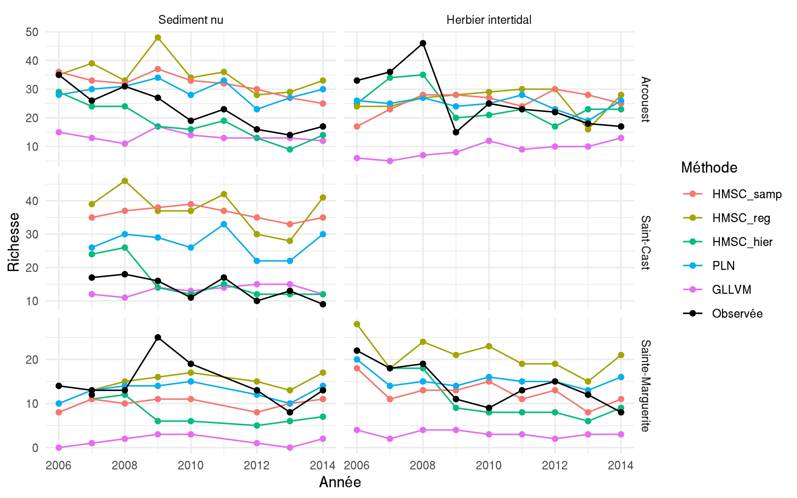

# Introduction

L'écologie moderne s'intéresse particulièrement à la répartition des espèces sur la surface du globe [@Worm_2018] et à la réorganisation de la biodiversité face aux changements environnementaux en cours [@Magurran_2019; @Blowes_2019]. Une multitude d'approches théoriques et empiriques a ainsi été développée pour comprendre les facteurs qui gouvernent la biogéographie des espèces et prédire les patrons spatiaux et temporels de biodiversités.

La capacité de persistance d'une espèce peut être définie grâce au concept de niche écologique tel que proposé par Hutchinson [@Hutchinson_1957]. Ainsi, la niche d'une espèce est représentée selon un hypervolume à n-dimemensions où chaque dimension correspond à une ressource ou une condition environnementale [@Blonder_2017] et permet de décrire les besoins ou la gamme de tolérance physiologique des organismes [@Sunday_2012]. Cette niche de Hutchinson peut être divisée en deux niches : (1) la niche de Grinnell qui s'intéresse plus particulièrement aux contraintes liées aux conditions abiotiques et caractérise la niche fondamentale de l'espèce [@Grinnell_1917]; (2) La niche d'Elton qui se focalise, principalement sur les interactions biotiques entre les individus [@Elton_2001]. En considérant le rôle des interactions biotiques en complément des contraintes environnementales, la niche d'Elton permet de décrire la niche réalisée des espèces, qui est en réalité celle observée *in situ*.

Une des manières d'avoir accès à la niche environnementale d'une espèce passe par l'expérimentation afin de délimiter des gammes et seuils de tolérances physiologiques des organismes [@Bates_2020]. Néanmoins, pour des contraintes pratiques, ces expériences peuvent difficilement prendre en compte les effets combinés de plusieurs facteurs abiotiques, et se concentrent souvent sur une seule voire deux variables environnementales (par exemple la température et la disponibilité en nourriture, ou encore le pH pour les études marines ciblées sur les changements en cours dans l'océan [@Boyd_2000; @Witman_2015]). Par ailleurs, ces expérimentations en mésocomsome concernent principalement des fines échelles spatiales, temporelles et écologiques (*i.e* échelle de l'individu plutôt que de la population ou de la communauté [@Witman_2015]). Ainsi, l'échelle de ces études expérimentales ne permet pas d'appréhender pleinement l'ensemble des phénomènes écologiques structurant l'échelle de tout un écosystème [@Leibold_2018]. Dans un contexte de changements globaux rapides induits par l'Homme, il est nécessaire d'accéder à des échelles spatiales, temporelles et écologiques plus larges [@Witman_2015; @Estes_2018], qui soit plus en lien avec les échelles auxquelles la société bénéficie, gère et affecte les écosystèmes [@Isbell_2017]. La modélisation écologique et notamment les modèles de distribution d'espèces, fournis un outil privilégié pour cela [@Edgar_2016].

## Prédire la distribution d'une espèce

Parmi les approches permettant d'étudier la répartition spatiale d’espèces, les modèles de distributions d'espèces (*Species Distribution Models* ; *SDM*) constituent sans conteste l'un des outils les plus utilisés sur ces vingt dernières années [@Melo_Merino_2020; @Guisan_2017]. Les *SDM* reposent sur l'utilisation de variables environnementales pour expliquer et prédire la répartition des espèces, la niche de Grinnel constituant "la colonne vertébrale des modèles de distribution d'espèce" [@Gravel_2018].

La première implémentation de SDM est apparue à la fin des années 80 avec la méthode *BIOCLIM* [@Busby_1991]. Le développement de ce type d'approche de modélisation a notamment été favorisé par les progrès informatiques qui les rendent faciles à mettre en oeuvre [@Ovaskainen_2020; @Araujo_2019]. Ainsi, des SDM ont utilisé des modèles linéaires généralisés [@Hastie_1992], des modèles linéaires additifs [@Wood_2011], ou bien encore plus récemment des modèles de machine learning basée sur des arbres [@Elith_2008][^1]. Ces modèles permettent uniquement de modéliser la distribution d'une seule espèce à la fois, ils sont qualifiés de *Single-species Distribution Model*.

[^1]: Un tableau listant quelques une des méthodes de SDM actuellement utilisées sont disponible dans le +@tbl:sdm en annexe.

De plus, si ces méthodes permettent de caractériser la niche potentielle des espèces, la niche réalisée et notamment l'aspect eltonien de la niche des espèces reste plus difficile à appréhender [@Dehling_2018; @Hortal_2015]. Comprendre le rôle des interactions biotiques dans la distribution des espèces est souvent un facteur limitant nos capacités à prédire les patrons spatiaux de biodiversité. 

## Prédire la distribution et les dynamiques des assemblages d'espèces

Si la question de recherche s'intéresse à la communauté dans son entièreté, il existe deux stratégies différentes pour modéliser la distribution de multiples espèces. Il est possible de prédire la distribution des espèces indépendamment et de les assembler en communauté ensuite (*Stack Species Distribution Model* ou *SSDM*), ou bien de  prédire la distribution des espèces et les conjointement (*Joint Species Distribution Model*) [@Ferrier_2006]. 

A l'inverse de l'approche climatologique largement appliquée dans le cas des *SDMs* ou des *SSDMs* qui vise à caractériser la répartition biogéographique des espèces, en ne considérant que très rarement les dynamiques temporelles de manières explicites, les *JSDMs* ont pour objectif de caractériser et de prédire la variabilité spatio-temporelle des communautés. Ils permettent par ailleurs d’intégrer des informations spécifiques additionnelles afin de tirer profit des similitudes entre espèces à l’échelle de la communauté, notamment via les traits fonctionnels ou encore la phylogénie (+@tbl:jsdm). 

De plus, les SSDMs, en combinant des modèles faits indépendamment pour chaque espèce, ne tiennent pas compte du filtre biotique que les espèces exercent les unes sur les autres et négligent donc l’aspect eltonien de leur niche [@Zurell_2019]. Au contraire, les JSDMs ont été développés en prenant en compte les patrons de co-occurrence à l’échelle d’une communauté afin de modéliser conjointement la distribution de chaque espèce au sein de toute la communauté en tenant compte des filtres abiotiques [@warton2015]. Cette structure de co-occurrence fournit alors des informations potentielles sur les interactions entre espèces [@Ovaskainen_2017b].

|              *Joint species distribution model*           | Effets spatiaux  |  Effets temporels | Traits fonctionnels | Phylogénie  |     Référence     |
| :-------------------------------------------------------- | :--------------- | :---------------- | :------------------ | :---------- | :---------------- |
| *Bayesian ordination and regression analysis* (*BORAL*)   |     Implicite    |  Implicite        |         Oui         |    Non      | @Hui_2016         |
| *Hierachical modelling of Species Communities* (*HMSC*)   |     Explicite    |  Explicite        |         Oui         |    Oui      | @Ovaskainen_2017a |
| *Generalized linear latent variable models* (*GLLVM*)     |     Implicite    |  Implicite        |         Oui         |    Non      | @Niku_2019        |
| *Poisson lognormal model* (*PLN*)                         |     Implicite    |  Implicite        |                     |    Non      | @Chiquet_2019     |
Table: Quelques uns des modèles de *JSDM* et leurs fonctionnalités (adapté de @Ovaskainen_2020). {#tbl:jsdm}

## Comprendre le rôle des interactions biotiques

Bien que le rôle des interactions biotiques dans la structure des communautés et la coexistence des espèces est depuis longtemps reconnu [@Paine_1966; @Hardin_1960], leur influence à larges échelles a pendant longtemps été négligée. Ainsi, l’explication des patrons biogéographique de diversité s’est concentrée sur le rôle des filtres abiotiques [@Tittensor_2010; @Soininen_2014]. Il est aujourd’hui clair que le rôle des interactions biotiques ne peut être éludé dans l’étude des patrons de biodiversité à larges échelles [@Wisz_2012]. Leur importance est néanmoins variable dans le temps, dans l’espace et selon les systèmes biologiques [@Leibold_2018]. Par exemple,  la compétition pour l’espace et la prédation sont des facteurs extrêmement structurant pour les communautés benthiques des estrans rocheux. La compétition entre les balanes et les moules est un exemple classique en écologie intertidale de compétition pour le substrat [@Hawkins_2019]. De même, le rôle de la prédation des étoiles de mers sur les balanes et sur les moules est à l’origine du concept d’espèce « clé de voute » (Paine). A contrario, les plages de sable sont moins structurées par les interactions que les estrans rocheux et sont généralement plus structurés par les forces hydrodynamiques et autres facteurs abiotiques [@Defeo_2005; @Woodin_2019]. Clarifier le rôle relatif des interactions biotiques par rapport aux filtres environnementaux dans différents systèmes et à différentes échelles paraît alors primordial.

Observer et quantifier les interactions dans les écosystèmes marins est une tâche difficile. Pour les écosystèmes pélagiques, il est possible d’utiliser différentes techniques comme l’observation directe, l’étude des contenus stomacaux ou bien l’analyse isotopique d’acides gras [@Majdi_2018].  Lorsque ces méthodes sont difficiles à mettre en place, comme c'est le cas pour les écosystèmes benthiques aux larges échelles qui nous intéressent ici, @Majdi_2018 proposent d'utiliser des méthodes d'inférences statistiques. Ainsi, les *JSDMs* peuvent être des outils intéressants pour mieux comprendre les interactions biotiques des écosystèmes intertidaux benthiques.

## Objectifs scientifiques

Différentes implémentations de ces modèles conjoints de distribution d’espèces (+@tbl:jsdm) ont vu le jour ces dernières années sous l’influence forte de théorie issue de l’écologie végétale concernant le rôle des interactions dans la structuration des communautés de plantes à larges échelles spatiales et temporelles [@warton2015]. De récents travaux se sont intéressés à comparer certaines de ces méthodes. @Norberg_2020 ont comparé trente-trois modèles de distributions d’espèces sur des jeux de données de présence/absence de communautés végétales. [@Momal_2020] quant à eux ont comparé la capacité de reconstruction de réseaux d’interaction à partir de résultats de modèles *JSDMs* entrainés sur des données d’abondance d’une communauté de poissons et sur des données de métabarcoding issu d’une communauté fongique. [@Niku_2019] présentaient le *JSDM* qu’ils avaient développé, et l’appliquait à une commutée de fourmis.

Le but global de ce travail est d’explorer le potentiel de différentes méthodes de *JSDMs* pour expliquer et prédire la diversité benthique. Grâce à la structure des *JSDMs* nous allons prendre en compte les facteurs abiotiques pour mieux comprendre les patrons spatiotemporels de la biodiversité benthique et les interactions biotiques à l’échelle de la communauté. Pour ce faire, nous allons nous concentrer sur trois implémentations différentes des *JSDMs* : l’un des meilleurs cadres de modélisation décrits par @Norberg_2020 (*HMSC*), celui utilisé par @Momal_2020 (*PLN*) et celui développé par @Niku_2019 (*GLLVM*). L'application de ces trois méthodes sur les mêmes données d'abondance faunistiques permettra par la même occasion de comparer la performance de ces modèles, puisqu’à notre connaissance aucune étude n'a comparé ces trois méthodes lorsqu'elles sont appliquées aux écosystèmes benthiques. L’innovation de cette étude est donc double : effectuer la première comparaison simultanée de ces trois modèles, et effectuer une des premières approches de *JSDM* sur de la faune benthique inféodée aux habitats meubles.

# Matériel et méthode

## Cas d'étude

### Jeu de données

Le jeu de donnée utilisé dans ce travail est issu du *REseau de surveillance BENthique*. Ce réseau de surveillance a été créé en 1999 à la suite du naufrage du pétrolier Erika. Le but de ce réseau est d'acquérir des connaissances sur les habitats benthiques côtiers et de détecter des changements de la diversité biologique de ces habitats [@Rebent2016]. Ce protocole de suivis se concentre sur la macrofaune (> 1mm) et la méthodologie détaillée est présentée dans @Boye_2019. Seulement deux de ces habitats ont été retenus pour comparer les trois méthodes de modélisations : les herbiers de zostères et les sédiments meubles nus.

### Communauté faunistique

La communauté faunistique d’intérêt dans ce travail est celle des polychètes. Les polychètes sont des animaux marins du phylum des annélides [@Lecointre_2001]. Cette classe a été choisie, car les animaux la composant ont des modes de vie très divers [@Boye_2019]. Il est classique de catégoriser les polychètes en plusieurs groupes en fonction de leurs modes de vie : certains sont nageurs, ou tubicoles, ou bien encore benthiques fouisseurs. Leurs régimes alimentaires sont aussi très variés, il existe des polychètes prédateurs, mais également des suspensivores ou psamivores [@Jumars_2015]. Toutefois, ces animaux restent assez mal connus par la communauté scientifique [@Troudet_2017].

Les zostères sont des phanérogames marines qui lorsque leur densité est forte, créent des "herbiers". En Bretagne, il existe deux espèces de zostères : la zostère marine (*Zostera marina*) et la zostère naine (*Zostera noltii*). Ces herbiers forment des habitats pour de nombreuses espèces. Ils ont un rôle fonctionnel important pour beaucoup d'espèces en tant que zone de nurserie, de reproduction et de nourrissage [@Lefcheck_2019; @McDevitt_Irwin_2016]. Cet habitat est connu pour sa plus grande richesse spécifique par rapport à d'autres habitats comme les sédiments meublent nus [@Hily_1999; @Boye_2017; @Sunday_2016]. Le suivi du *REBENT* se concentre sur les herbiers de *Z. marina*, car cette espèce fait déjà partie du livre rouge des espèces menacées [@Rebent2016; @Waycott_2009]. Toutefois, les mesures de protections mises en place vis-vis de cet habitat semblent porter leurs fruits en Europe [@de_los_Santos_2019].

Les plages de sable abritent des communautés dominées par les crustacés les mollusques et les polychètes [@Defeo_2005]. Cet habitat est contraint principalement par trois facteurs abiotiques : les marées, la houle et le sédiment. L'interaction entre ces trois facteurs crée un grand éventail de plages différentes : de la plage où la mer ne se retire que très peu à marée basse aux plages dont de vastes étendues de sable sont découvertes lors des grandes marées [@Defeo_2005]. La richesse spécifique sur ces plages est fortement influée par la hauteur des marées et dans une moindre mesure par la température de l'eau et la taille des sédiments [@Defeo_2013; @Defeo_2017].  Ces plages de sable fin ont aussi un rôle écologique important de nurserie pour de nombreuses espèces de poissons plats [@Quillien_2017]. Toutefois, les plages de sable sont des biocénoses menacées. Ce sont des habitats à la fois menacés par les changements globaux (hausse du niveau des mers, érosion...) et par les activités anthropiques telles que l'urbanisme ou bien les activités récréatives [@Defeo_2009].

Vingt-trois sites le long de la façade bretonne ont été retenus, représentant 215 échantillons collectés sur une période s'étalant entre 2006 et 2014. Ce jeu de données contient 96 taxa différents. Certains sites ont été échantillonnés deux fois, car présentant les deux habitats. Vingt sites ont été utilisés pour entrainer les différents modèles et trois ont été utilisés pour faire de la validation croisée sur ces mêmes modèles (fig. @fig:sitemap). 

{#fig:sitemap}

### Données environnementales 

Six variables environnementales ont été sélectionnées (tableau : {@tbl:env}). La salinité, la température et la vitesse des courants proviennent de la base de données publique *PREVIMER* basée sur les résultats des modèles de *MARS3D*. Le fetch a été calculé à partir des polygones terrestres disponibles dans *OpenStreetMap*. Les variables granulométriques ont été échantillonnées *in situ* (protocole détaillé dans @Boye_2017). Chaque variable environnementale a été centrée et transformée en polynôme de degrés un avant d'être utilisé par les différents modèles. 

|  Abréviation  |     Définition                             |    Unité    |
| :------------ | :----------------------------------------- | :---------- |
|   Fetch       |    Fetch moyen                             |     Km      |  
|   MO          |   Concentration en Matière organique       |   %         |
|   SAL_sd      | Ecart-type de la salinité de l'eau         | PSS-78      |
|   TEMP_sd     | Ecart-type de la température de l'eau      | °C          |
|   CURR_mean   | Force moyenne des courants                 | m.s^-1^     |
|   Mud         | Concentration de boue dans les sédiments   | %           |
|   Trask_So    | Indice de Trask - Homogénéité du sédiment  | Aucune      |
Table: Variables environnementales utilisées par tous les modèles. {#tbl:env}

## Modèle de distribution d'espèces conjointes

Bien que chaque implémentation des *JSDMs* soient différente et permettent de prendre en compte différents types de données (+@tbl:jsdm), ces modèles sont tous des extensions multivariées à variables latentes des modèles linéaires généralisés classiques [@Hui_2016 ; @Ovaskainen_2017a; @Niku_2019; @Chiquet_2019]. Un modèle à variables latentes (*LVM*) simple peut être écrit comme suit (l'ensemble des notations mathématiques sont présentées dans le glossaire) :

$$ y_{ij} = g\left(m_{ij}\right) = x_{i.} \times \beta_j + Z_{i.} \times \lambda_j $${#eq:lvm} 

Avec $y_{ij}$ représentant l'abondance prédite de l'espèce $i$ au site $j$. $g(m_{ij})$ une fonction de l'abondance moyenne de l'espèce $j$ au site $i$. $x_i$ le vecteur de variable environnementale au site $i$, $\beta_j$ le coefficient de l'effet environnemental pour l'espèce $j$. Et avec $Z_i.$ la matrice de variable latente associée aux sites et $\lambda_j$ la matrice de poids associés à l'espèce $j$.

La résolution de cette équation n'est possible que si l'on admet des contraintes additionnelles telles que par exemple [@warton2015] : 
$$\left(Z_i \times \lambda_j\right) \sim \mathcal{N}\left(0, \Omega\right)$$ {#eq:lvmconst}

Avec $\Omega$ la matrice de covariance résiduelle entre espèces qui est estimé à l'aide de la matrice de poids associé aux espèces $\Lambda$.

$$\Omega = \Lambda \Lambda^\prime$$ {#eq:loadings}

Ainsi, les *LVMs* permettent de prendre en compte des éventuelles variables explicatives manquantes tout en estimant la corrélation entre espèces. Un autre avantage des variables latentes est que l'estimation de matrice de corrélation entre espèces est plus simple que par rapport à un modèle linéaire à effets mixtes généralisés. La matrice de coordonnés des espèces ($\lambda$) dans le cas d'un *LVM* a au plus autant de colonnes que de variables latentes (+@eq:lvmconst et @eq:loadings), tandis que dans le cas d'un modèle linéaire à effets mixte généralisé celle-ci à autant de colonnes que d'espèces [@warton2015]. Ainsi, le nombre de variables latentes utilisées par le modèle est donc un paramètre crucial, puisqu'il permet de faire un compromis entre précisions de la matrice de corrélation résiduelle et la réduction du temps de calcul et des degrés de liberté utilisés [@warton2015]. 

|              *Joint species distribution model*           | Effets spatiaux  |  Effets temporels | Traits fonctionnels | Phylogénie  |     Référence     |
| :-------------------------------------------------------- | :--------------- | :---------------- | :------------------ | :---------- | :---------------- |
| *Bayesian ordination and regression analysis* (*BORAL*)   |     Implicite    |  Implicite        |         Oui         |    Non      | @Hui_2016         |
| *Hierachical modelling of Species Communities* (*HMSC*)   |     Explicite    |  Explicite        |         Oui         |    Oui      | @Ovaskainen_2017a |
| *Generalized linear latent variable models* (*GLLVM*)     |     Implicite    |  Implicite        |         Oui         |    Non      | @Niku_2019        |
| *Poisson lognormal model* (*PLN*)                         |     Implicite    |  Implicite        |                     |    Non      | @Chiquet_2019     |
Table: Quelques uns des modèles de *JSDM* et leurs fonctionnalités (adapté de @Ovaskainen_2020). {#tbl:jsdm}

Trois cadres de modélisations ont été sélectionnés : *HMSC*, *GLLVM* et *PLN* et au total cinq variantes de modèles ont été créées. L'ensemble des caractéristiques de ces variantes de modèles sont présentées dans le +@tbl:summarymod .

### *Hierachical modelling of Species Communities*

*HMSC* est un modèle mixte linéaire généralisé, hiérarchique et multivarié, ajusté par inférence bayésienne [@Ovaskainen_2020]. Ce cadre de modélisation rend possible l'utilisation de traits et de la phylogénie pour ajuster les niches abiotiques des taxa. La particularité de ce modèle est qu'il est hiérarchique, ainsi chaque effet aléatoire donne lieu à sa propre matrice de corrélation résiduelle [@Ovaskainen_2017a]. L'+@eq:hmsc présente la formulation mathématique d'un modèle n'utilisant que des variables environnementales et un nombre $n_r$ d'effets aléatoires. En plus des effets aléatoires classiques, ce cadre de modélisation permet de prendre en compte des effets aléatoires spatiaux et temporels.

$$ y_{ij} = g\left(m_{ij}\right) = x_i \times \beta_j + \sum_{r = 1}^{n_r} Z_{ir} \times \lambda_{rj} $$ {#eq:hmsc}

Etant un modèle bayésien, la distribution a posteriori est échantillonnée grâce à la méthode MCMC [@Ovaskainen_2017b]. L'utilisation de l'inférence bayésienne permet à l'utilisateur de ne pas spécifier le nombre de variables latentes à utiliser pour chaque effet aléatoire. Le modèle ajuste le nombre de variables latentes pour que celles non significatives soient tronquées [@Ovaskainen_2020].

Trois modèles *HMSC* ont été créés : un premier sans l'inclusion d'effets aléatoires (*HMSC_reg*), un second avec un seul effet aléatoire lié à l'échantillon (*HMSC_samp*) et un dernier avec trois facteurs aléatoires liés respectivement à l'année, au site et à l'habitat. Les calculs ont été réalisés avec le package *Hmsc* [@Tikhonov_2019b; @Hmsc_2019]. Chaque modèle dispose de quatre chaînes de Markov et chaque chaîne effectue 1,5 million d'itérations avant de se stopper. L’étape de *burning* supprime les 500 000 premières itérations de chaque chaîne.  Les chaînes sont échantillonnées toutes les mille itérations. Les priors par défaut ont été utilisés. Avant de regarder les résultats des différents modèles du framework *HMSC*, la validité de ces modèles a été inspectée. La bonne convergence des chaînes a été vérifiée à l'aide de l'outil de diagnostic de Gelman-Rubin [@Gelman_1992]. Enfin, le nombre d'échantillons indépendants pour chaque paramètre a été jugé satisfaisant.

### Modèle de Poisson Lognormal

Le modèle de Poisson lognormal est modèle linéaire mixte et multivarié. Il ne peut modéliser qu'une seule sorte de distribution : la distribution (conditionnelle) de Poisson lognormal +@eq:pln [@Aitchison_1989; @Chiquet_2019]. Un modèle simple avec uniquement des variables environnementales peut être écrit de cette façon :

$$y_{ij}|Z_{ij} \sim \mathcal P\left(exp\left\{x_i \times \beta_j + Z_{ij}\right\}\right)$$ {#eq:pln}

Le vecteur latent $Z_i$ prend en compte les variations d'abondance non expliquées par les variables environnementales incluses dans le modèle [@Momal_2020]. Cette variable latente agit comme un effet aléatoire lié à l'échantillon [@Momal_2020]. Dans ce cadre de modélisation, il y a autant de variables latentes différentes qu'il y a d'espèces et la distribution de cette variable latente est paramétrisée de la manière suivante :

$$Z_i \sim N\left(0_{n_s}, \Omega^{-1}\right) $$ {#eq:constpln}

Le modèle a été créé avec le package R *PLNmodels* [@Chiquet_2019]. Le modèle utilise une distribution de Poisson lognormal et aucun terme d'offset n'a été ajouté au modèle. Les paramètres par défaut ont également été utilisés pour ajuster le modèle.

### *Generalized linear latent variable models*

*GLLVM* est un modèle mixte linéaire généralisé et multivarié ajusté par la méthode du maximum de vraisemblance. Ce cadre de modélisation prend en compte l'utilisation de variables environnementale et peut également inclure des traits. Un modèle ajusté avec ce type de modèle sans traits peut être écrit comme l'+@eq:lvm. Ce modèle présente une manière innovante de maximiser la vraisemblance en utilisant une approximation variationnelle gaussienne de la log-vraisemblance pour le cas où la fonction de lien serait des données de comptage surdispersé, binaires ou encore ordinales [@Niku_2019]. Cette méthode de maximisation de la log-vraisemblance permet d'accélérer les calculs. Comparativement à Boral [@Hui_2016], *GLLVM* peut réaliser les mêmes calculs en quelques minutes au lieu de quelques heures. Contrairement à HMSC, *GLLVM* demande à l'utilisateur de choisir le nombre de variables latentes qu'utilisera le modèle [@Gllvm_2019].

Le modèle a été créé avec le package R *gllvm* [@Niku_2019; @Gllvm_2019]. Le modèle utilise une distribution négative binomiale et vingt variables latentes. 

| Nom du modèle | Framework | Distribution statistique |    Nombre de facteur aléatoire  | Nombre de variables latentes |
| :------------ | :-------- | :----------------------- | :------------------------------ | :--------------------------- |
| HMSC_reg      | HMSC      | Poisson lognormal        | 0                               | $0$                          |
| HMSC_samp     | HMSC      | Poisson lognormal        | 1                               | $n_l \in \mathbb{N}^*$       |
| HMSC_hier     | HMSC      | Poisson lognormal        | 3                               | $n_l \in \mathbb{N}^*$       |
| PLN           | PLN       | Poisson lognormal        | 1                               | $n_l \in \mathbb{N}^*$       |
| GLLVM         | GLLVM     | Negative binomial        | 0                               | $20$                         |
Table: Descriptif des modèles utilisés. ^*^ Lorsque des effets aléatoires sont définis pour les modèles HMSC, un nombre infini de variables latentes peut être généré, seules les variables latentes latentes sont conservées (voir @Bhattacharya_2011 pour plus d'informations). {#tbl:summarymod}

## Reconstruction des réseaux d'interactions

Les réseaux d'interactions sont reconstruits pour chaque modèle à grâce au package *EMtree*. Le principe de l'algorithme contenu dans ce package est d'inférer des interactions entre espèces en utilisant des arbres couvrants (graphes connectant tous les noeuds sans aucune boucle). La probabilité conditionnelle $P$ d'une arrête entre les espèces $j$ et $k$ est décrite dans ce modèle comme la somme des probabilités conditionnelles des arbres la contenant. Ainsi la probabilité qu'une arrête fasse partie du réseau d'intérêt est simplement sa probabilité conditionnelle moyennée par le nombre d'abers couvrant [@Momal_2020].

Pour mettre en place cet algorithme, le package maximise l'équation de log-vraisemblance suivante

$$\mathcal L = \sum_{1\leq j < k \leq p} P_{jk} log\left(\beta_{jk}\widehat{\psi_{jk}}\right) - logB - cst$$ {#eq:emtree}

où $\beta_{jk}$ est le poids contrôlant la probabilité de l'arrête ($j,k$) de faire partie du réseau d'interaction, $B$ une constante de normalisation et $\widehat{\psi_{j,k}}$ qui résume l'information apporté par les données d'abondance à propos de l'arrête ($j, k$). Ainsi, les matrices de corrélations résiduelles interspécifiques de chaque modèle servent à initialiser l'algorithme pour les valeurs de $\widehat{\psi_{j,k}}$.

## Critères de comparaison entre les méthodes

### Pouvoir explicatif

Le pouvoir explicatif de chaque modèle pour chaque taxon est donné par une mesure de pseudo-*R^2^*, dénommé après *SR^2^*. Pour les modèles de Poisson, le *SR^2^* est basé sur la mesure de la corrélation de Spearman entre les données d'abondance observées et prédites [@Ovaskainen_2020]. Cette mesure est calculée de la façon suivante pour l'espèce $j$ :

$$ SR^2_j = sgn\left(r_s\left(y_{.j}, \hat{y}_{.j}\right)\right) \times r_s\left(y_{.j}, \hat{y}_{.j}\right)^2 $$ {#eq:eq2}

### Validation croisée

Parmi les vingt-trois sites étudiés, trois ont été utilisés pour effectuer de la validation croisée sur les modèles. Deux sites présentent les deux habitats et le dernier présente uniquement des sédiments meubles. La performance des modèles a été comparée sur deux critères : la prédiction de l'abondance de chaque espèce et la prédiction de leur occurrence. 

### Prédiction de l'abondance

Chaque modèle entrainé a été utilisé pour prédire l'abondance des espèces présentes dans les trois sites de validation. La qualité de la prédiction a été évaluée par l'erreur quadratique moyenne (*RMSE*).

#### Prédiction de l'occurrence

Pour prédire l'occurrence de chaque espèce à partir des données d'abondance, un seuil a été établi. Une espèce est considérée comme présente dans un site dès lors que son abondance est supérieure ou égale à celle qui maximise le J de Youden dans l'espace de la courbe *ROC*. Cette statistique du *J de Youden* a été utilisée, car elle prend en compte à la fois la sensibilité et la spécificité.

### Comparaison des réseaux inférés

Les réseaux reconstruits sont comparés à l'aide des outils de la théorie des graphes appliqués aux graphes probabilistes [@Poisot_2015]. Ces outils sont issus du package EcologicalNetworks.jl [@Poisot_2019]. Quatre métriques ont été sélectionnées : le nombre de liens, la connectance, la centralité de Katz et l'emboitement. Le nombre de liens et la connectance sont des propriétés fondamentales de la structure des réseaux trophiques et des réseaux d'interactions [@Martinez_1992]. Par exemple, la résistance d'un réseau écologique aux perturbations est par  proportionnelle à sa connectance. La connectance est le nombre de liens $l$ divisé par le nombre de liens possibles $(S\times(S-1)/2)$, cette mesure est comprise entre 0 et 1. La centralité de Katz permet de connaître l'importance de chaque espèce dans le réseau. L’emboitement d'un réseau $\eta$ est une mesure indiquant si les espèces forment des petits groupes dans le réseau faisant partie de plus gros groupes. Cette mesure est comprise entre 0 et 1. L'hypothèse a été faite que des réseaux fortement imbriqués promeuvent une plus grande diversité en minimisant la compétition [@Bastolla_2009].[^2]

[^2]: Pour le calcul de la centralité de Katz et de l'imbrication, se référé à @Poisot_2019 .

Pour tous les modèles incluant au moins une variable latente, un réseau a été reconstruit grâce à la matrice de $\Omega$. Pour la méthode HMSC_hier, un réseau par effet aléatoire a été reconstruit, chaque effet aléatoire ayant sa propre matrice $\Omega$. Un méta-réseau moyennant les probabilités de chaque méthode a également été créé. L'ensemble des différents réseaux sont représentés en annexe [NDR : Ajouter en annexes].

### Validation par experts

Douze paires d'interactions ont été soumises à un panel de cinq experts en polychètes. Les experts ont évalué la vraisemblance de chaque interaction sur une échelle de 0 à 4 :

0. Ces deux taxa n'interagissent pas ;

1. Ces deux taxa ne peuvent probablement pas interagir ;

2. Pas d'avis sur l'interaction de ces deux taxa ;

3. Ces deux taxa peuvent probablement interagir ;

4. Ces deux taxa interagissent.

Les experts ont effectué cette évaluation sans avoir connaissance des probabilités d'interactions calculées par les modèles. A cause du petit nombre d'expert, les réponses ont été aggrégés en trois catégories : interaction possible, interaction impossible et ne se prononce pas. La concordance de l'avis des experts a été mesurée à l'aide de l'indice de concordance le $W$ de Kendall [@Legendre_2005]. Enfin, les experts ont donnés leur avis sur la qualité des réseaux reconstruits par la méthode *EMtree*.

## Matériel informatique logiciels utilisés

L'ensemble des calculs ont été réalisés par le supercalculateur de l'IFREMER DATARMOR. Les calculs pour tous les modèles ont été réalisés par le supercalculateur de l'IFREMER DATARMOR. Le processeur de chaque noeud de calculs du cluster HPC est un CPU Intel E5-2680 v de 14 coeurs cadencés à 2,40 GHz. Chaque modèle n'utilisait pas plus d'un seul coeur. 

Les modèles ont été mis en place à l'aide du langage de programmation R [@RCoreTeam_2019]. Les résultats ont été analysés conjointement grâce aux langages R [@RCoreTeam_2019] et Julia [@Bezanson_2017]. L'ensemble des packages et des libraires utilisés par ces deux langages sont présentés dans l'annexe [NDR Rajouter annexe].

# Resultats  

## Performance des modèles

### Capacités explicatives

Les capacités explicatives de l'abondance des différents modèles permettent de les séparer en deux groupes différents (+@fig:SR2). La forme de la distribution du *SR^2^* pour les deux groupes de modèles est aussi caractéristique. Les modèles *PLN*, *GLLVM* et *HMSC_reg* ont un pouvoir explicatif moyen de l'abondance autour de 0,10 contre 0,25 pour les modèles *HMSC_samp* et *HMSC_hier*. De plus, *HMSC_samp* et HMSC_hier expliquent bien mieux l'abondance de certaines espèces, avec un SR2 compris entre 0;60 et 0,80 contre 0,40 pour modèles *PLN*, *GLLVM* et *HMSC_reg*. Chacun de ces deux groupes de modèles présentant les mêmes espèces dont l'abondance est la mieux expliquée. Néanmoins, ces performances en termes de pouvoir explicatif sont à mettre en perspective du grand nombre d'espèces ayant un *SR^2^* inférieur à 0,10.

{#fig:SR2}

### Prédiction de l'occurrence et de l'abondance

La validation croisée sur trois sites tests (exclus lors de l'apprentissage) permet la comparaison de la performance de la prédiction de la richesse spécifique (+@fig:predocc et +@tbl:RMSEocc).

{#fig:predocc}

Aucun modèle n'arrive à reproduire la distribution de la richesse observée aux sites de validation +@fig:predocc . La richesse moyenne observée aux sites de validation est d'environ 20 espèces. *GLLVM* est le modèle dont la richesse moyenne prédite est la plus proche de celle observée, en ayant toutefois tendance à sous-estimer la richesse moyenne. Au contraire, *PLN*, *GLLVM* et *HMSC_samp* surestimes la richesse moyenne. Ces modèles prédisent une richesse moyenne deux fois supérieure à celle observée. En revanche *HMSC_hier* a un comportement un peu différent des trois derniers modèles. Bien que surestimant également la richesse aux sites de validation, *HMSC_hier* surestime moins fortement la richesse.

Bien que graphiquement les performances de ces modèles peuvent sembler faibles, le *RMSE* indique que l'erreur sur la prédiction de la richesse spécifique est relativement faible (+@tbl:RMSEocc). Le *RMSE* médian est de 7 pour le modèle *GLLVM* et de 16 pour le modèle *HMSC_hier*. Mais ce *RMSE* médian est près de deux fois plus élevé pour les modèles *PLN*, *HMSC_samp* et *HMSC_reg*. Il est a noter que le *RMSE* maximum ne dépasse pas le nombre de maximums d'espèce de notre jeu de donnée.

|Method      | Min|     Q1| Median|  Moy   |     Q3|   Max|
|:-----------|:---|:------|:------|:-------|:------|:-----|
|*GLLVM*     | $0$|  $3,0$|    $7$|  $7,63$| $10,0$|  $29$|
|*HMSC_hier* | $1$| $11,5$|   $16$| $15,37$| $20,0$|  $33$|
|*PLN*       | $4$| $21,0$|   $27$| $27,28$| $33,0$|  $51$|
|*HMSC_reg*  | $6$| $25,0$|   $33$| $32,84$| $40,5$|  $56$|
|*HMSC_samp* | $4$| $18,5$|   $30$| $29,65$| $38,5$|  $62$|
Table: Statistiques descriptives du *RMSE* de la richesse spécifique par modèle. Les modèles sont classés par ordre croissant de *RMSE* maximal. Q1 et Q3 représentent respectivement le premier et troisième quartile du *RMSE* de chaque modèle. {#tbl:RMSEocc}

---
# Si l'on s'intéresse maintenant à la prédiction de l'abondance en fonction des années, des sites et des habitats, il est possible de remarquer *HMSC_hier* semble être le modèle qui arrive le mieux à prédire les changements de richesses spécifiques (+@fig:occpred). C'est le seul modèle qui suit la tendance à la diminution de la richesse spécifique dans les herbiers de l'Arcouest ainsi que dans les herbiers de Sainte-Marguerite en 2009. Pour les sédiments nus, les prédictions de la richesse semblent être plus difficiles à réaliser, aucun modèle n'a su prédire l'augmentation rapide de la richesse spécifique observée en 2009 à Sainte-Marguerite (+@fig:occpred).
---

Les modèles président correctement la variabilité de la richesse inter-site en trouvant tous l'ordre de grandeur de la richesse spécifique pour chaque site (+@fig:occpred). Les modèles prédisent mieux la richesse spécifique dans les herbiers que dans les plages de sable. HMSC_hier est le modèle qui semble le mieux à prédire la variabilité de la richesse spécifique. Ce modèle arrive à également prédire les fluctuations temporelles, notamment la diminution de la richesse spécifique observée en 2009.

{#fig:occpred}

### Abondance

Aucun modèle ne parvient à prédire de manière satisfaisante l'abondance des espèces à chaque site. Le modèle le moins mauvais est le modèle *HMSC_hier* dont la plus faible valeur de RMSE pour une espèce est de 24 individus et la plus forte valeur de RMSE est de l'ordre de $10^4$. Bien que cette erreur soit importante, elle est négligeable fasse à la plus faible du modèle GLLVM qui est de l'ordre de $10^31$. 

## Effets de l'environnement

Les effets environnementaux prédits par les modèles semblent cohérents à travers les modèles (+@fig:effectenv). Tous les modèles montrent que l'effet des variables environnementales diminue moins les modèles sont capable d'expliquer correctement les espèces. De plus, tous les modèles montrent un effet positif pour la variable *Trask* à l'exception du modèle HMSC_hier qui montre un effet négatif, voire faiblement négatif sur l’abondance des espèces. Les variables environnementales sont ordonnées par proportion décroissante de variances expliquées, il est possible de remarquer que des variables mesurées à l'échelle du site comme le Fetch ou la force moyenne du courant explique une plus grande variance que les variables sédimentologiques comme l'indice de Trask ou la concentration en boue mesurée à une échelle locale. Les espèces les mieux expliquées en moyenne par les modèles se trouvent en haut du graphique, ces espèces ont pour caractéristiques d'être relativement commune et ubiquiste tout en étant inféodé aux sables fins.

{#fig:effectenv}

## Résaux reconstruits

### Analyse des graphes

Tous les réseaux probabilistes reconstruits présentent le même nombre de liens 182. Toutefois l'écart-type du nombre de liens est légèrement plus important chez les réseaux du modèle *HMSC_hier*. La connectance $C$ est quasiment identique pour tous les modèles. L'imbrication $\eta$ des réseaux est quasi-nulle et les réseaux reconstruits ont une connectance dix fois plus faible que des réseaux benthiques précédemment étudiés [@Dunne_2004]. 

| Méthode          | $\sigma_l$ |  $C \pm \text{sd}$ |  $\eta$   |
|:-----------------|:---------- |:-------------------|----------:|
|HMSC_samp         | $12,70$    |   $0,022\pm 0,001$ | $0,03$    |
|HMSC_hier_annee   | $13,10$    |   $0,021\pm 0,15$  | $0,03$    |
|HMSC_hier_site    | $12,46$    |   $0,021\pm 0,15$  | $0,03$    |
|HMSC_hier_habitat | $13,11$    |   $0,021\pm 0,15   | $0,03$    |
|HMSC_hier_moyen   | $13,07$    |   $0,021\pm 0,15$  | $0,03$    |
|GLLVM             | $12,51$    |   $0,021\pm 0,15$  | $0.04     |
|PLN               | $12,60$    |   $0,022\pm 0,001$ | $0.04$    |
Table: Métrique des réseaux d'interactions reconstruits. $\sigma_l$ représente l'écart-type du nombre de liens. Connectance $\pm$ écart-type. $\eta$ imbrication des réseaux trophiques. {#tbl:metrics}

---
# L'avis des experts du taxon des polychètes sur le réseau moyen est que le réseau moyen est assez intéressant d'un point de vue biologique (+@fig:meannet). Il laisse paraître des interactions proies-prédateurs comme celles entre *Perinereis cultrifera* et *Lumbrineris spp.*, *Magelona filiformis* et *Sigalion mathildae* ou bien encore *Scalibregma celticum* et *Sthenelais boa*. La probabilité d'interaction forte entre *Platynereis dumerilii* et *Euclymene spp.* et entre *Notomastus latericeus* pourrait traduire de la compétition. *Platynereis dumerilii* est un brouetteur de microphyto benthos et les deux autres espèces sont des déposivores. Ces taxa pourraient entrer en compétition pour l'espace. De plus, ces trois taxa sont également ceux avec la plus grande centralité du réseau moyen, cette importante dans le réseau est peut-être liée à la forte dominance des espèces déposivores ou brouetteuses dans cette communauté.
---

Le réseau moyen reconstruit sur la base des corrélations résiduelles entre espèces ou groupes d'espèces met en évidence un nombre restreint d'interactions fortement probables, qui pour partie semblent probantes d'un point de vue biologique (+@fig:meannet). Toutefois, il est possible de remarque que beaucoup d'espèces ne semblent pas avoir de liens dans le réseau. Cela montre qu'une majorité des interactions reconstruites ont une faible probabilité ($p <= 0,2$).

{#fig:meannet}

Plusieurs réseaux d'interactions peuvent être dérivés de HMSC en grâce à  chacun des facteurs aléatoires inclus dans le modèle. La +@fig:hmschierannee présente le réseau reconstruit sur la base des corrélations résiduelles associées au facteur aléatoire temporel de *HMSC*. Les interactions inférées sont uniquement associées à des corrélations positives entre espèces.

---
# *HMSC* a la particularité de pouvoir générer plusieurs réseaux d'interaction grâce à l'inclusion de plusieurs facteurs aléatoire. Ainsi en s'intéressant à la +@fig:hmschierannee, il est possible de noter qu'il n'y a que des corrélations positives entre les espèces lorsque l'algorithme reconstruit une interaction. Pour le facteur aléatoire temporelle, il n'y a qu'une seule relation de proie-prédateur retrouvé par le modèle qui concerne uniquement deux taxa *Macroclymene santanderensis* et *Scoletoma spp.*. Le reste des interactions semble être des interactions de facilitation.
---
{#fig:hmschierannee}

### Avis des experts du taxon des polychètes

L'analyse de concordance de Kendall montre qu'il n'y a pas de concordance entre les différents experts quant à la probabilité des interactions représentées ($W = 0.26$, $p > 0.2$). En dégradant les notes attribuées par les experts en deux catégories : interaction possible ou impossible (+@fig:expert), l'analyse de concordance de Kendall indique qu'il n'y a toujours pas de consensus entre nos experts ($W = 0.2$, $p > 0.44$).

{#fig:expert}

## Coût de calcul

Chaque modèle présente des caractéristiques propres en termes de coup de calcul (+@tbl:coutcalc). Les modèles les plus longs à donner leurs résultats proviennent du framework *HMSC*, leur coût en mémoire vive reste cependant faible. Le temps de calcul augmente considérablement avec le nombre d'effets aléatoires passant de plus de 25h pour le modèle le plus simple à près de 458h pour le modèle le plus complexe. *GLLVM* est un modèle plus rapide à ajuster que *HMSC*, il est plus rapide à ajuster que le modèle sans effet aléatoire *HMSC_reg*. Toutefois, sa vitesse est largement contrebalancée par le coût important en mémoire vive. Ce modèle nécessite 68 Go de RAM pour pouvoir être ajusté. *PLN* quant à lui est le modèle le plus économe à ajuster, il n'a besoin que de trois minutes et moins de 500 Mo de RAM pour être ajusté.

|     Modèle     |   Temps de calcul (h : mn)   |      RAM (Go)    |
| :------------- | :--------------------------: | :--------------: |
| *HMSC_reg*     | $25:27$                      | $0,49$           |
| *HMSC_samp*    | $170:56$                     | $0,69$           |
| *HMSC_hier*    | $457:50$                     | $0,73$           |
| *PLN*          | $00:03$                      | $0,37$           |
| *GLLVM*        | $13:43$                      | $68,1$           |

Table: Coût de calculs des différents modèles. {#tbl:coutcalc}

---
# Le temps de calcul pour les modèles *HMSC* dépend fortement de la taille des données d'abondance faunistique, du nombre de variables explicatives, mais surtout dans ce cas-ci de la structure des effets aléatoires inclus. De plus, l'ajustement de modèles par la méthode *MCMC* est aussi une opération très couteuse en puissance de calculs. Toutefois, le temps de calcul peut être réduit en faisant tourner les chaînes de Markov en parallèle. Cette solution n'a pas pu être mise en oeuvre à cause de bugs informatiques.

# Le coût en mémoire vive de *GLLVM* s'explique par la manière dont sont sauvegardés les paramètres de la régression : à eux seuls, ils pèsent un peu moins de 43 Go. Ce poids peut être réduit en diminuant le nombre de variables latentes utilisées, ce qui réduit en même temps du temps de calcul.

# *PLN* quant à lui est le modèle le plus économe en termes de coût de calculs, notamment grâce à sa structure de variable latente qui n'inclue qu'un seul effet aléatoire.
---

# Discussion

## Comprendre et prédire la diversité benthiques

Les différents modèles présentés ici expliquent correctement qu'une toute petite partie de la communauté de polychètes. Les modèles tels que *HMSC_hier* et *HMSC_samp* semblent tirer partis de leur structure hiérarchique expliquer convenablement un plus grand nombre d'espèces par rapport aux modèles ne disposant pas d'une telle structure. Si l'on s'intéresse cette fois-ci aux facteurs qui expliquent le mieux les espèces de cette communauté, il est possible de remarquer que ce sont les effets aléatoires qui contribuent le plus à leurs explications. Ainsi, le manque de pouvoir explicatif des variables environnementales semble montrer que la niche écologique des espèces de cette communauté est mal définie dans nos modèles. 

Nos modèles disposent d'une assez bonne prédiction de l'occurrence. Ces résultats sont consistants avec les précédentes comparaisons [@Norberg_2020; @Momal_2020; ]. L'une des promesses des *JSDM* est de pouvoir prédire également l'abondance des espèces, la performance des modèles testés ici est assez décevante, le *RMSE* maximal pour le meilleur modèle est de l'ordre de $10^4$. *GLLVM* est le moins bon de nos modèles testés, sa performance en termes de prédiction de l'abondance est inférieur à celle du modèle régression sans prise en compte des interactions (*HMSC_reg*). Cette différence peut venir de plusieurs facteurs : la distribution négative binomiale a été utilisée pour le modèle *GLLVM* contrairement aux autres modèles qui utilisent la distribution de Poisson lognormal. De plus, la résolution de ce genre d'équation par approximation variationnelle semble donner des résultats moins précis que *HMSC* [@warton2015]. Dans l’ensemble, la faible qualité de la prédiction de l'abondance peut en partie être expliquée par le faible pouvoir explicatif des variables environnementales utilisées pour entrainer nos modèles. En ayant une meilleure connaissance de la niche écologique de cette communauté, il serait possible d'améliorer significativement la qualité prédictive de ces modèles [@Leach_2016; @Barbaro_2019]. 

Grâce à la bonne capacité de prédiction de l'occurrence de nos différents modèles, la prédiction de la richesse spécifique et de ses variations spatiotemporelles est assez satisfaisante dans l'ensemble. De même, la mauvaise capacité de prédiction de l'abondance empêche l'analyse des éventuelles variations spatiotemporelle de l'abondance. 

## Role et inférence des interactions biotiques

Prendre en compte les interactions dans nos modèles améliore globalement leurs capacités de prédictions si nous les comparons aux résultats d'un modèle de régressions multivarié tel que *HMSC_reg* qui se retrouve toujours parmi les moins bons modèles. Ce résultat est en accord avec la littérature, puisque la prise en compte des interactions biotiques améliore les capacités prédictives des modèles linéaires.

Bien que la prise en compte des interactions par les différents modèles se fait de la même manière à l'aide de variables latentes, l'implémentation de ces variables latentes change entre les modèles. Cette différence d'inclusion des interactions dans les différents modèles a des effets qui se répercutent l'impact des facteurs environnementaux dans les modèles. L'indice de Trask semblait être une variable très structurante dont pour beaucoup d'espèces. Cependant, en prenant en compte un plus grand nombre de variables latentes, le modèle *HMSC_hier* a démontré que son effet était beaucoup moins important que ce que nous pensions précédemment et qu'il était quasiment nul pour les espèces les mieux prédites par ce modèle.

Dans leur ensemble, la structure des réseaux reconstruits est cohérente avec la vision qu'en ont nos experts. De plus, la valeur de la connectance est proche de celle observée pour des réseaux d'interaction en écologie et d'autres réseaux trophiques benthiques [@Martinez_1992; @Dunne_2004]. Toutefois, ces réseaux diffèrent également de ce qui a pu être observé dans ces présents travaux.  Le nombre de liens identique à travers tous les réseaux reconstruits peut sembler étrange au premier regard. C'est une conséquence de la manière dont sont générés ces graphes à l'aide de l'algorithme *EMtree* et de la façon dont sont calculés les liens dans le cadre des réseaux écologiques probabilistes [@Poisot_2015]. Pour reconstruire ces réseaux *EMtree* parcourt l'ensemble des arbres couvrants possibles. Dans notre cas, notre communauté compte $p = 92$ espèces, il y a donc $p^{p-2}$ arbres couvrant possible différent, soit un total de $5,51\times 10^{176}$. Dans un cadre de réseaux probabilistiques, le nombre de liens $l$ est calculé comme étant la somme des probabilités contenue dans la matrice $\left(p \times p\right)$. *EMtree* parcourant toujours le même espace d'arbre couvrant possible. C'est pourquoi la somme des probabilités de la matrice d'interaction (nombre de liens) est toujours identique, quelle que soit la méthode. Les réseaux reconstruits présentent une imbrication (nestedness) très faible par rapport à ce que montre la littérature des réseaux trophiques benthique [@Nordstrom_2015]. Cette différence peut être reliée au fait que nous nous concentrons sur une communauté particulière, celle des polychètes, qui ne constitue pas à elle seule un réseau trophique. En effet, il nous manque beaucoup d'acteurs pour obtenir un réseau trophique d'une communauté benthique, certains poissons et d'autres invertébrés par exemple, sont des prédateurs de polychètes et ne sont pas inclus dans les réseaux que nous avons reconstruits. De plus, d'autres types d'interactions comme de la facilitation peuvent être incluses dans les réseaux reconstruits expliquant pourquoi la valeur d'imbrication est bien inférieure à celle qu'il est possible de trouver dans la littérature.

Le manque de concordance entre nos différents experts quant à la probabilité des interactions reconstruites s'explique de différente façon. Tout d'abord, les polychètes sont des animaux assez mal connus actuellement [@Troudet_2017]. Il reste de nombreuses interrogations quant à leurs modes de vie et les possibles interactions avec d'autres membres de ce taxon. De plus, certains patrons de co-occurrence ont semblé étranges à nos experts. Le très fort nombre de corrélations positives obtenues par l'effet aléatoire temporelle du modèle *HMS_hier* n'était pas attendu (+@fig:hmschierannee).  @Thurman_2019 en utilisant des données empiriques a montré que plus une espèce interagissait avec d'autres, plus la corrélation résiduelle entre ces espèces était faible et tendait à être positif, ce qui est en adéquation avec notre observation.

## Forces et faiblaisses des différentes approches

Dans leur ensemble, les modèles testés dans ce travail sont assez prometteurs. Leur capacité à prédire convenablement l'occurrence des espèces et son évolution spatiotemporelle pourrait servir à évaluer l'impact de certains changements environnementaux sur la composition des communautés. Certains modèles comme HMSC offrent la possibilité, grâce à leur structure hiérarchique de découper les corrélations résiduelles entre espèces en différents niveaux. Cette particularité offre un regard plus fin sur les possibles interactions interspécifiques. 

Bien que certains modèles semblent sensiblement plus performants que d'autres, aucun  n'est parfait : "Tous les modèles sont faux, mais certains sont utiles." [@Box_1979]. Ainsi, chaque modèle représente un *trade-off* entre une plus grande précision et un coût de calcul plus élevé. *HMSC_hier* est le modèle le plus précis, mais au pris d'un temps de calcul extrêmement élevé. Si la question de recherche se trouve être la prédiction de l'occurrence, il est préférable de se tourner vers *GLLVM*. Ce modèle offre de meilleures performances pour un temps de calcul plus court en comparaison de *HMSC*, bien que ce modèle nécessite beaucoup de mémoire vive. Si cette ressource n'est pas disponible, une alternative représentant un bon compromis pourrait être *PLN*, bien que la simplicité de ce modèle puisse lui faire manquer de polyvalence.

Notre méthode de travail présente également plusieurs avantages pour inférer les interactions à partir des données d'occurrence. Ainsi, notre méthodologie de reconstructions de réseaux d'interactions suit plusieurs recommandations émises par @Blanchet_2020 . Tout d'abord, notre travail utilise des données d'abondance qui sont plus riche en informations que les données de présence/absence. De plus, nous utilisons une méthode basée sur les graphes pour reconstruire les interactions, ce qui évite que les interactions indirectes soient confondues avec des interactions directes. Toutefois, @Blanchet_2020 pointent plusieurs lacunes tant d'un point de vue théorique que pratique qui permet de douter de la qualité des interactions inférées par les *JSDM*. Un signal de co-occurrence peut par exemple, provenir de variables environnementales mal prises en compte par le modèle. Bien que les variables latentes puissent capturer ce signal, il n'est pas possible d'en différencier le signal biotique du signal d'une ou plusieurs variables environnementales manquantes [@Blanchet_2020]. Lorsque le signal de corrélation entre taxa est faible, le nombre d'échantillons nécessaire pour détecter une interaction est extrêmement élevé. L'ordre de grandeur du nombre d'échantillons nécessaire peut dépasser celui du millier et n'est pas atteint dans ce travail. Enfin, les modèles de *JSDM* sont incapables de prédire les interactions négatives très fortes car, ces dernières sont incompatibles avec la coexistence [@Blanchet_2020].

## Perspectives

Certains des modèles utilisés dans ce travail présentent la propriété d'être assez flexible. *HMSC* et *GLLVM* peuvent en effet inclure des traits fonctionnels pour contraindre un peu plus les prédictions. Par exemple, pour modéliser des taxa les plus rares grâce aux traits fonctionnels, *HMSC* "emprunte" de l'information aux taxa les plus communs en faisant l'hypothèse que deux espèces aux traits similaires réagissent de façon analogue aux gradients environnementaux [@Ovaskainen_2020]. Une autre voie d'amélioration possible pour *HMSC* serait d'implémenter de façon implicite des effets aléatoires spatiaux et temporels [@Ovaskainen_2017a]. Ces ajouts pourraient certainement améliorer les capacités explicatives des différents modèles, mais également réduire les erreurs de prédictions de l'abondance. Ces modifications des modèles pourraient également permettre de mieux prédire les interactions en découplant encore un peu plus le signal de corrélations résiduelles abiotique du signal biotique.

Ces modèles pourraient également bénéficier d'un autre axe de validation se basant cette fois-ci sur la diversité $\beta$. Une suite logique aux analyses spatiotemporelles mise en place dans ce travail de recherche serait les analyses de trajectoires telles que décrites par @De_Caceres_2019 . En utilisant des principes géométriques, cette méthode permet d'étudier la dynamique spatiotemporelle de différentes communautés. Il serait donc possible de voir si certains des *JDSM* présentent des dynamiques similaires ou non.

Les réseaux d'interactions en écologie présentent des caractéristiques particulières [@Pascual_2006]. C'est pourquoi il serait intéressant de tester les capacités de reconstruction des réseaux d'interactions de ces *JDSM* sur des réseaux aux propriétés connus, comme des réseaux d'interaction basés sur des données d'abondances générées. Cela permettrait de mieux comprendre si certaines propriétés particulières comme la faible imbrication des réseaux d'interaction observée est un artefact numérique ou bien une réelle propriété du réseau lié à cette communauté. Les interactions inférées quant à elles pourraient profiter d'autres moyens de validation en plus des dires d'experts comme des méthodes basées sur le fractionnement isotopique le long du réseau trophique. Toutefois, le manque de connaissance expérimentale sur ces taxa peut représenter le frein le plus important à la mise en place de cette forme de validation.

Bien que ce travail centré sur les polychètes présente quelques limites liées à l'absence d'autres, les méthodes testées ici peuvent créer un pont avec les dernières méthodes de métabarcoding qui s'intéressent également aux interactions [@Djurhuus_2020]. Allier les *JSDM* à ces méthodes omiques permettrait d'obtenir une vision d'ensemble de la biodiversité et des réseaux d'interaction écologique en prenant en compte toutes les facettes de la biodiversité. Par ailleurs, l'alliance à ces méthodes omiques offre des challenges intéressants en termes d'optimisation de calcul. Ces optimisations numériques pourraient profiter aux *JSDM* qui ne sont aujourd'hui pas applicables aux données omiques de par le nombre d'unités taxonomiques beaucoup plus grand que le nombre d'espèces composant les communautés modélisées actuellement par les *JDSM*.

# Bibliographie 

---
# Allow us te place the references where I want.
---

::: {#refs}
:::

# Annexes

|        *Single-species distribution model*             |     Référence             |  
| :------------------------------------------------------ | :------------------------ |
| *Boosted regression trees* (*BRT*)                      | @dismo; @gbm; @Elith_2008 | 
| *Generalised additive model* (*GAM*)                    | @Wood_2011                |
| *Generalised linear model* (*GLM*)                      | @RCoreTeam_2019           |
| *Gradient nearset neighbour* (*GNN*)                    | @Crookston_2007           |
| *Maximum-entropy approach* (*MaxEnt*)                   | @Phillips_2006            |
| *Multivariate adaptive regression spline* (*MARS-COMM*) | @Milborrow_2017           |
| *Random forest* (*RF*)                                  | @Liaw_2002                |
| *Support vector machine* (*SVM*)                        | @Meyer_2019               |
| *Gradient extreme boosting* (*XGB*)                     | @Chen_2019                |
Table: Quelques-uns des modèles de *SDM* les plus populaires actuellement (adapté de @Ovaskainen_2020). {#tbl:sdm}