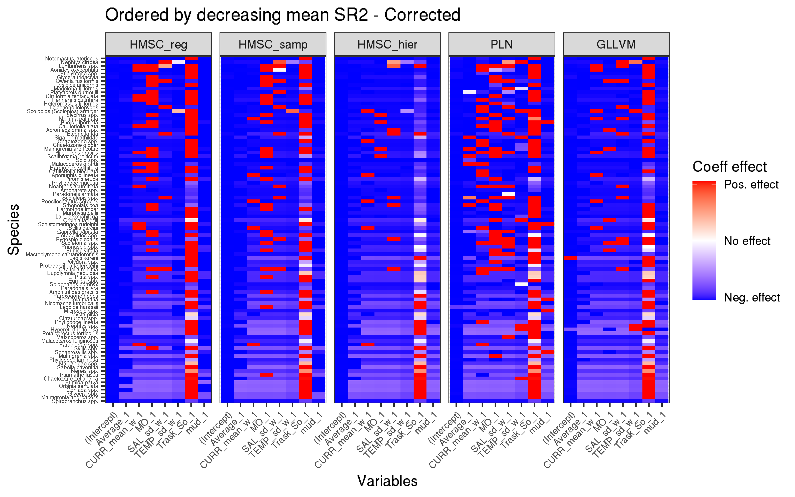

# Introduction

L'écologie moderne s'intéresse particulièrement à la façon dont les espèces sont distribuées à la surface du globe. Des outils théoriques et pratiques ont ainsi été développés pour permettre de répondre à cette question. Les besoins d'une espèces pour persister peuvent par exemple être décrit par la niche écologique de Hutchinson, un hypervolume à n-dimemensions où chaque dimension représente une ressource ou une condition environnementale [@Hutchinson_1957]. Cette niche de Hutchinson peut être divisée en deux niches : la niche de Grinnell qui s'intéresse plus particulièrement aux conditions abiotiques nécessaires pour qu'une espèce persiste et la niche d'Elton qui se focalise principalement sur les interactions biotiques entre les individus [@Grinnell_1917; @Elton_2001].

Pour expliquer et prédire la distribution des espèces à l'aide de variables environnementales, des modèles nommés *Species Distribution model* (*SDM*) ont été créés. Ces modèles s'appuient sur les niches écologiques des espèces pour prédire leurs distributions. C'est ainsi que la niche de Grinnell "constitue la colonne vertébrale des modèles de distribution d'espèces" [@Gravel_2018].

## *Species-distribution model*

Le premier framework de *SDM* est apparu dans les années 80 avec le package *BIOCLIM*, mais depuis ces vingt dernières années, un réel engouement s'est créé autour de ce cadre de modélisation. Ce type de modèle est apprécié notamment grâce à son large cadre d'application qui s'étend au-delà de l'écologie des communautés et grâce aux progrès informatiques et mathématiques qui les rendent facile à mettre en oeuvre [@Ovaskainen_2020; @Araujo_2019]. 

|        *Single-species distribution model *             |     Référence    |  
| :------------------------------------------------------ | :--------------- |
| *Boosted regression trees* (*BRT*)                      | @dismo; @gbm     | 
| *Generalised additive model* (*GAM*)                    | @Wood_2011       |
| *Generalised linear model* (*GLM*)                      | @RCoreTeam_2019  |
| *Gradient nearset neighbour* (*GNN*)                    | @Crookston_2007  |
| *Maximum-entropy approach* (*MaxEnt*)                   | @Phillips_2006   |
| *Multivariate adaptive regression spline* (*MARS-COMM*) | @Milborrow_2017  |
| *Random forest* (*RF*)                                  | @Liaw_2002       |
| *Support vector machine* (*SVM*)                        | @Meyer_2019      |
| *Gradient extreme boosting* (*XGB*)                     | @Chen_2019       |
Table: Quelques-uns des modèles de *SDM* les plus populaires actuellement (adapté de @Ovaskainen_2020). {#tbl:sdm}

A l'origine ces modèles se contentaient de modéliser la distribution d'une seule espèce à la fois et sont qualifiés de *Single-species Distribution Models* (+{@tbl:sdm}). Toutefois, si la question de recherche s'intéresse à la communauté, il existe deux stratégies différentes pour modéliser la distribution des espèces la composant. Il est possible prédire la distribution des espèces chacune de leur côté et de les assembler en communauté ensuite (*Stack Species Distribution Model* ou *SSDM*), ou bien de  prédire la distribution des espèces et les assembler en même temps (*Joint Species Distribution Model*) [@Ferrier_2006]. La différence majeure entre les deux méthodes est que les *SSDMs* ne tiennent pas compte du filtre biotique que les espèces exercent les unes sur les autres [@Zurell_2019]. Au contraire, les *JSDMs*  ont été développés en prenant en compte la co-occurrence qui existe entre les espèces, permettant de modéliser à la fois la distribution d'une espèce en particulier et de toute la communauté en tenant compte du filtre biotique [@warton2015]. Cette structure de co-occurrence particulière permet d'inférer de manière plus ou moins directe les interactions entre espèces [@Ovaskainen_2017b]. De plus, comme les *JSDMs* modélisent toute la communauté en une seule fois, ces modèles sont moins à risque de surapprentissage que les *SSDM*.

## Joint Species Distribution Model

Les *JSDMs* présentés dans le +@tbl:jsdm sont tous des extensions multivariées à variables latentes des modèles linéaires généralisés classiques [@Hui_2016 ; @Ovaskainen_2017a; @Niku_2019; @Chiquet_2019]. Un modèle à variables latentes (*LVM*) simple peut être écrit comme suit[^1] :

$$y_{ij} = g\left(m_{ij}\right) = x_i \times \beta_j + Z_i \times \lambda_j$$ {#eq:lvm}

[^1]: Le formalisme mathématique est décrit ici. 

La résolution de cette équation est possible si l'on admet des contraintes additionnelles telles que par exemple [@warton2015] : 
$$\left(Z_i \times \lambda_j\right) \sim N\left(0, \Omega\right)$$ {#eq:lvmconst}

Et que la matrice de covariance $\Omega$ est égale à :

$$\Omega = \lambda \lambda^\prime$$ {#eq:loadings}

Ainsi, les *LVMs* permettent de prendre en compte des éventuelles variables explicatives manquantes tout en estimant la corrélation entre espèces. Un autre avantage des variables latentes est que l'estimation de matrice de corrélation entre espèces est plus simple que par rapport à un modèle linéaire à effets mixtes généralisés. La matrice de coordonnés des espèces ($\lambda$) dans le cas d'un *LVM* a au plus autant de colonnes que de variables latentes (+@eq:lvmconst et @eq:loadings), tandis que dans le cas d'un modèle linéaire à effets mixte généralisé celle-ci à autant de colonnes que d'espèces [@warton2015]. Ainsi, le nombre de variables latentes utilisées par le modèle est donc un paramètre crucial, puisqu'il permet de faire un compromis entre précision de la matrice de corrélation résiduelle et la réduction du temps de calcul et des degrés de libertés utilisés [@warton2015].

|              *Joint species distribution model*           |     Référence     |
| :-------------------------------------------------------- | :---------------- |
| *Bayesian ordination and regression analysis* (*BORAL*)   | @Hui_2016         |
| *Hierachical modelling of Species Communities* (*HMSC*)   | @Ovaskainen_2017a |
| *Generalized linear latent variable models* (*GLLVM*)     | @Niku_2019        |
| *Poisson lognormal model* (*PLN*)                         | @Chiquet_2019     |
Table: Quelques uns des modèles de *JSDM* (adapté de @Ovaskainen_2020). {#tbl:jsdm}

### *Hierachical modelling of Species Communities*

*HMSC* est un modèle mixte linéaire généralisé, hiérarchique et multivarié, ajusté par inférence bayésienne [@Ovaskainen_2020]. Ce cadre de modélisation rend possible l'utilisation de traits et de la phylogénie pour ajuster les niches abiotiques des taxa. La particularité de ce modèle est qu'il est hiérarchique, ainsi chaque effet aléatoire donne lieu à sa propre matrice de corrélation résiduelle [@Ovaskainen_2017a]. L'+@eq:hmsc présente la formulation mathématique d'un modèle n'utilisant que des variables environnementales et un nombre $n_r$ d'effets aléatoires. En plus des effets aléatoires classiques, ce cadre de modélisation permet de prendre en compte des effets aléatoires spatiaux et temporels (ces derniers sont traités comme un cas particulier d'effet aléatoire spatiale à une seule dimension).

$$y_{ij} = g\left(m_{ij}\right) = x_i \times \beta_j + \sum_{r = 1}^{n_r} Z_{ir} \times \lambda_{rj}$$ {#eq:hmsc}

Etant un modèle bayésien, la distribution a posteriori est échantillonné grâce à la méthode MCMC [@Ovaskainen_2017b]. L'utilisation de l'inférence bayésienne permet à l'utilisateur de ne pas spécifier le nombre de variables latentes à utiliser pour chaque effet aléatoire. Le modèle ajuste le nombre de variables latentes pour que celles non significatifs soient tronquées [@Ovaskainen_2020].

### *Generalized linear latent variable models*

GLLVM est un modèle mixte linéaire généralisé et multivarié ajusté par la méthode du maximum de vraisemblance. Ce cadre de modélisation prend en compte l'utilisation de variables environnementale et peut également inclure des traits. Un modèle ajusté avec ce type de modèle sans traits peut être écrit comme l'+@eq:lvm. Ce modèle présente une manière innovante de maximiser la vraisemblance en utilisant une approximation variationnelle gaussienne de la log-vraisemblance pour le cas où la fonction de lien serait des données de comptage surdispersé, binaires ou encore ordinales [@Niku_2019]. Cette méthode de maximisation de la log-vraisemblance permet d'accélérer les calculs. Comparativement à Boral [@Hui_2016], *GLLVM* peut réaliser les mêmes calculs en quelques minutes au lieu de quelques heures. Contrairement à HMSC, *GLLVM demande à l'utilisateur de choisir le nombre de variables latentes qu'utilisera le modèle [@Gllvm_2019].

### *Poisson lognormal model*

Le modèle de Poisson lognormal est modèle linéaire mixte et multivarié. Il ne peut modéliser qu'une seule sorte de distribution : la distribution (conditionnelle) de Poisson lognormal +@eq:pln [@Aitchison_1989; @Chiquet_2019]. Un modèle simple avec uniquement des variables environnementales peut être écrit de cette façon :

$$Y_{ij}|Z_{ij} \sim P\left(exp\left\{x_i \times \beta_j + Z_{ij}\right\}\right)$$ {#eq:pln}

Le vecteur latent $Z_i$ prend en compte les variations d'abondance non expliquées par les variables environnementales incluses dans le modèle [@Momal_2020]. Cette variable latente agit comme un effet aléatoire lié au site [@Momal_2020]. Dans ce cadre de modélisation, il y a autant de variables latentes différentes qu'il y a d'espèces et la distribution de cette variable latente est paramétrisée de la manière suivante :

$$Z_i \sim N\left(0_{n_s}, \Omega^{-1}\right) $$ {#eq:constpln}

---
## Reconstruction de réseaux d'interactions
#
#Tous les modèles de *JDSM* présentés ci-dessus permettent d'accéder à la corrélation résiduelle entre espèces grâce aux variables latentes inclues dans les modèles [@warton2015]. Mais reconstruction de graphe d'interaction à partir des données d'abondance ajustés par les *JSDM* pose problème puisque les données d'abondance peuvent avoir une large gamme de valeurs et ces données ne suivent pas une distribution normale [@Momal_2020].
#
#Pour surmonter ces difficultés, nous avons utiliser une méthode nommé *EMtree* qui se base sur les arbres couvrants (graphes connectant tous les noeuds sans aucune boucle) [@Momal_2020]. Cette méthode permet de définir la probabilité condtionnelle d'un lien entre deux espèces comme la somme des probabilités des arbres couvrant contenant cette interaction. 
#
#Le principe de l'algorithme contenu dans ce package est d'inférer des interactions entre espèces en utilisant des arbres couvrants (graphes connectant tous les noeuds sans aucune boucle). La probabilité conditionnelle $P$ d'une arrête entre les espèces $j$ et $k$ est décrite dans ce modèle comme la somme des probabilités conditionnelles des arbres la contenant. Ainsi la probabilité qu'une arrête fasse partie du réseau d'intérêt est simplement sa probabilité conditionnelle moyennée sur l'ensemble des arbres couvrant [@Momal_2020].
#
#Pour mettre en place cet algorithme, le package maximise l'équation de log-vraisemblance suivante
#
#$$L = \sum_{1\leq k < l \leq p} P_{kl} log\left(\beta_{kl}\widehat{\psi_{kl}}\right) - logB - cst$$ {#eq:emtree}
#
#où $\beta_{kl}$ est le poids contrôlant la probabilité de l'arrête ($k,l$) de faire partie du réseau d'interaction, $B$ une constante de normalisation et $\widehat{\psi_{j,k}}$ qui résume l'information apporté par les données d'abondance à propos de l'arrête ($k, l$). Ainsi, les matrices de corrélations résiduelles interspécifiques issues de chaque modèle servent à initialiser l'algorithme pour les valeurs de $\widehat{\psi_{k,l}}$.
#En ecologie on s'intéresse à comment les espèces sont répartis à la surface du globe. Histoire des niches écologique. Elles peuvent être soumises à des contraintes qui s'accentuent par l'homme. Besoin de modèle pour comprendre la distribution et l'impact des changements des conditio env. Nouveaux modèles développé ces cinq dernères années les JSDM. Ces méthodes ont été développé sur des concepts tirés de l'écologie des communautés végétales. Hors, les communautés benthiques subissent des contraintes environmentales beaucoup plus fortes (variation journalière de salinité, temp, UV, etc liés aux marées.). Est-ce que ces méthodes sont applicables aux communautés benthiques ? Pour cela test de trois cadre de modèles avec au total 5 modèles sur des données d'abondance de polychètes issus de deux milieux différents : les herbiers de *Zostera marina* et les estran à sédiment meubles.
---
## Cas d'étude

Le nombre croissant de modèles de distribution d'espèces amène à se questionner sur la performance de ces derniers [@Norberg_2020]. De plus, Les *JSDM* développés ses dernières années ont fortement été influencées par les théories de distribution des espèces issues de l'écologie végétale [@warton2015]. Cette base théorique ancré dans l'écologie végétale amène à se questionner sur leur performance en écologie marine. 

Les communautés benthiques sont très différentes dans le fonctionnement des communautés végétales [NDR: ref]. En effet, les communautés benthiques vivant dans la zone de balancement des marées sont soumises à des contraintes environnementales variant brusquement. A marée basse par exemple, la salinité et la température peuvent augmenter rapidement les jours de beau temps. Au contraire, les jours de pluie, la marrée basse peut aussi entrainer un stress osmotique sur les organismes benthiques intertidaux en diminuant fortement la salinité [NDR : refs]. 

C'est pourquoi évaluer la capacité de ces différents modèles à s'ajuster aux communautés benthiques marines est important avant de les utiliser. Ce travail s'intéresse à la comparaison du framework *Hierachical modelling of Species Communities* (*HMSC*), décrit comme l'un des meilleurs modèles actuels d'après @Norberg_2020 et de deux autres encore non évalués dans la littérature. Ces deux frameworks sont *Generalized linear latent variable models* (*GLLVM*) et *Poisson lognormal model* (*PLN*). Bien que certains modèles puissent prendre en compte des données comme les traits biologiques ou la phylogénie, ce travail ne s'intéressera qu'à l'utilisation de variables environnementales dans ces modèles. La comparaison s'est faite sur les capacités de prédiction de l'abondance et de la richesse spécifique, ainsi que de la qualité des réseaux d'interactions reconstruits par les différentes méthodes.

Le jeu de donnée utilisé dans ce travail est issu du *REseau de surveillance BENthique*. Ce réseau de surveillance a été créé en 1999 à la suite du naufrage du pétrolier Erika. Le but de ce réseau est d'acquérir des connaissances sur les habitats benthiques côtiers et de détecter des changements de la diversité biologique de ces habitats [@Rebent2016]. Ce sont six habitats benthiques différents  répartis sur l'ensemble des côtes bretonnes que surveille le *REBENT*. Ce protocole de suivis se concentre sur la macrofaune (> 1mm) et la méthodologie détaillée est présentée dans @Boye_2019. Seulement deux de ces habitats ont été retenus pour comparer les trois méthodes de modélisations : les herbiers de zostères et les sédiments meubles nus.

### Habitats

Les zostères sont des phanérogames marines qui lorsque leur densité est forte, créent des "herbiers". En Bretagne, il existe deux espèces de zostères : la zostère marine (*Zostera marina*) et la zostère naine (*Zostera noltii*). Ces herbiers forment des habitats pour de nombreuses espèces. Ils ont un rôle fonctionnel important pour beaucoup d'espèces en tant que zone de nurserie, de reproduction et de nourrissage [@Lefcheck_2019; @McDevitt_Irwin_2016]. Cet habitat est connu pour sa plus grande richesse spécifique par rapport à d'autres habitats comme les sédiments meublent nus [@Hily_1999; @Boye_2017; @Sunday_2016]. Le suivi du *REBENT* se concentre sur les herbiers de *Z. marina*, car cette espèce fait déjà partie du livre rouge des espèces menacées [@Rebent2016; @Waycott_2009]. Toutefois, les mesures de protections mise en place vis-vis de cet habitat semblent porter leurs fruits en Europe [@de_los_Santos_2019].

Les plages de sable de abritent des communautés dominées par les crustacés les mollusques et les polychètes [@Defeo_2005]. Cet habitat est contraint principalement par trois facteurs abiotiques : les marées, la houle et le sédiment. L'interaction entre ces trois facteurs crée un grand éventail de plages différentes : de la plage où la mer ne se retire que très peu à marée basse aux plages dont de vastes étendues de sable sont découvertes lors des grandes marées [@Defeo_2005]. La richesse spécifique sur ces plages est fortement influée par la hauteur des marées et dans une moindre mesure par la température de l'eau et la taille des sédiments [@Defeo_2013; @Defeo_2017].  Ces plages de sable fin ont aussi un rôle écologique important de nurserie pour de nombreuses espèces de poissons plats [@Quillien_2017]. Toutefois, les plages de sable sont des biocénoses menacées. Ce sont des habitats à la fois menacés par les changements globaux (hausse du niveau des mers, érosion...) et par les activités anthropiques telles que l'urbanisme ou bien les activités récréatives [@Defeo_2009].

### Communauté faunistique

La communauté faunistique d’intérêt dans ce travail est celle des polychètes. Les polychètes sont des animaux marins du phylum des annélides [@Lecointre_2001]. Cette classe a été choisie, car les animaux la composant ont des modes de vie très divers [@Boye_2019]. Il est classique de catégoriser les polychètes en plusieurs groupes en fonction de leurs modes de vie : certains sont nageurs, ou tubicoles, ou bien encore benthiques fouisseurs. Leurs régimes alimentaires sont aussi très variés, il existe des polychètes prédateurs, mais également des suspensivores ou psamivores [@Jumars_2015].

# Matériel et méthode

## Cas d'étude

### Jeu de données

### Communauté faunistique

La communauté faunistique d’intérêt dans ce travail est celle des polychètes. Les polychètes sont des animaux marins du phylum des annélides. Cette classe a été choisie, car les animaux la composant ont des modes de vie très divers. Il est classique de catégoriser les polychètes en plusieurs groupes en fonction de leur habitat : certains sont nageurs, ou tubicoles, ou bien encore benthiques fouisseurs. Leurs régimes alimentaires sont aussi très variés, il existe des polychètes prédateurs, mais également des suspensivores ou psamivores [@Lecointre_2001].

### Données environnementales 

Six variables environnementales ont été sélectionnées (tableau : {@tbl:3}). La salinité, la température et la vitesse des courants proviennent de la base de données publique *PREVIMER* basée sur les résultats des modèles de *MARS3D*. Le fetch a été calculé à partir des polygones terrestres disponibles dans *OpenStreetMap*. Les variables granulométriques ont été échantillonnées *in situ* (protocole détaillé dans @Boye_2017). Chaque variable environnementale a été centrée et transformée en polynôme de degrés un avant d'être utilisé par les différents modèles. 

|  Abréviation  |     Définition                             |    Unité    |
| :-----------: | :----------------------------------------: | :---------: |
|   Average     |    Fetch moyen                             |     Km      |  
|   MO          |   Concentration en Matière organique       |   %         |
|   SAL_sd_w    | Ecart-type de la salinité de l'eau         | PSS-78      |
|   TEMP_sd_w   | Ecart-type de la température de l'eau      | °C          |
|   CURR_mean_w | Force moyenne des courants                 | m.s^-1^     |
|   mud         | Concentration de boue dans les sédiments   | %           |
|   Trask_So    | Indice de Trask - Homogénéité du sédiment  | Aucune      |
Table: Variables environnementales utilisées par tous les modèles. {#tbl:3}

## Logiciels utilisés

L'ensemble des calculs ont été réalisés par le supercalculateur de l'IFREMER DATARMOR à l'aide des langages de programmation R [@RCoreTeam_2019] et Julia [@Bezanson_2017]. L'ensemble des packages et des libraires utilisés par ces deux langages sont présentés dans l'annexe [NDR Rajouter annexe].

## *Joint Species Distribution Models*

Les modèles de "distribution d'espèces conjointes" (*Joint Scpecies Distribution Models* ou *JSDM*) sont une évolution des modèles de distribution d'espèces (*Species Distribution Models* ou *SDM*). Contrairement à ces derniers, les *JSDM* se proposent de modéliser la distribution de toutes les espèces simultanément . De plus, ces méthodes incluent une structure de covariance particulière permettant d'avoir accès aux informations quant à la co-occurrence entre espèces [@warton2015; @Ovaskainen_2017a ; @Tikhonov_2019a].

### *HMSC*

Les calculs ont été réalisés avec le package *Hmsc* [@Tikhonov_2019b; @Hmsc_2019]. Trois modèles HMSC ont été créés : un premier sans l'inclusion de variables latentes, le second avec une seule variable latetente et le troisième comprenant trois variables latentes. La distribution Poisson Lognormal a été choisie pour les trois modèles. Chaque modèle dispose de quatre chaînes de Markov et chaque chaîne effectue 1,5 million d'itérations avant de se stopper. L’étape de *burning* supprime les 500 000 premières itérations de chaque chaîne.  Les chaînes sont échantillonnées toutes les mille itérations. Les priors par défaut ont été utilisés.

### PLN

Le modèle a été créé avec le package R *PLNmodels* [@Chiquet_2019]. Le modèle utilise une distribution de Poisson lognormal et aucun terme d'offset n'a été ajouté au modèle. 

### GLLVM

Le modèle a été créé avec le package R *gllvm* [@Niku_2019; @Gllvm_2019]. Le modèle utilise une distribution négative binomiale et vingt variables latentes. 

## Reconstruction des réseaux d'interactions

Les réseaux d'interactions sont reconstruits pour chaque modèle à grâce au package *EMtree*. Le principe de l'algorithme contenu dans ce package est d'inférer des interactions entre espèces en utilisant des arbres couvrants (graphes connectant tous les noeuds sans aucune boucle). La probabilité conditionnelle $P$ d'une arrête entre les espèces $j$ et $k$ est décrite dans ce modèle comme la somme des probabilités conditionnelles des arbres la contenant. Ainsi la probabilité qu'une arrête fasse partie du réseau d'intérêt est simplement sa probabilité conditionnelle moyennée par le nombre d'abers couvrant [@Momal_2020].

Pour mettre en place cet algorithme, le package maximise l'équation de log-vraisemblance suivante

$$L = \sum_{1\leq j < k \leq p} P_{jk} log\left(\beta_{jk}\widehat{\psi_{jk}}\right) - logB - cst$$ {#eq:emtree}

où $\beta_{jk}$ est le poids contrôlant la probabilité de l'arrête ($j,k$) de faire partie du réseau d'interaction, $\Beta$ une constante de normalisation et $\widehat{\psi_{j,k}}$ qui résume l'information apporté par les données d'abondance à propos de l'arrête ($j, k$). Ainsi, les matrices de corrélations résiduelles interspécifiques de chaque modèle servent à initialiser l'algorithme pour les valeurs de $\widehat{\psi_{j,k}}$.

## Critères de comparaison entre les méthodes

### Pouvoir explicatif

Le pouvoir explicatif de chaque modèle pour chaque taxon est donné par une mesure de pseudo-*R^2^*, dénommé après *SR^2^*. Pour les modèles de Poisson, e *SR^2^* est basé sur la mesure de la corrélation de Spearman entre les données d'abondance observées et prédites [@Ovaskainen_2020]. Cette mesure est calculée de la façon suivante pour l'espèce $j$ :

$$ SR^2_j = sgn\left(r_s\left(y_{.j}, \hat{y}_{.j}\right)\right) \times r_s\left(y_{.j}, \hat{y}_{.j}\right)^2 $$ {#eq:eq2}

### Validation croisée

Parmi les vingt-trois sites étudiés, trois ont été utilisés pour effectuer de la validation croisée sur les modèles. Deux sites présentent les deux habitats et le dernier présent uniquement des sédiments meubles. La performance des modèles a été comparée sur deux critères : la prédiction de l'abondance de chaque espèce et la prédiction de leur occurrence. 

### Prédiction de l'abondance

Chaque modèle entrainé a été utilisé pour prédire l'abondance des espèces présentent dans les trois sites de validation. La qualité de la prédiction a été évaluée par l'erreur quadratique moyenne (*RMSE*).

#### Prédiction de l'occurrence

Pour prédire l'occurrence de chaque espèce à partir des données d'abondance, un seuil a été établi. Une espèce est considérée comme présente dans un site dès lors que son abondance est supérieure ou égale à celle qui maximise le J de Youden dans l'espace de la courbe *ROC*. Cette statistique du *J de Youden* a été utilisée, car elle prend en compte à la fois la sensibilité et la spécificité.

### Comparaison des réseaux inférés

Les réseaux reconstruits sont comparés à l'aide des outils de la théorie des graphes appliqués aux graphes probabilistes [@Poisot_2015]. Ces outils sont issus du package EcologicalNetworks.jl [@Poisot_2019]. Quatre métriques ont été sélectionnées : le nombre de liens, la connectance, la centralité de Katz et l'emboitement.

### Validation par experts

Douze paires d'interactions ont été soumises à un panel de cinq experts en polychètes. Les experts ont évalué la vraisemblance de chaque interaction sur une échelle de 0 à 4 :

0. Ces deux taxa n'interagissent pas ;

1. Ces deux taxa ne peuvent probablement pas interagir ;

2. Pas d'avis sur l'interaction de ces deux taxa ;

3. Ces deux taxa peuvent probablement interagir ;

4. Ces deux taxa interagissent.

La concordance de l'avis des experts a été mesurée à l'aide du *Kappa de Fleiss* [@Fleiss1973]. Enfin, la corrélation entre l'avis moyen des experts et la probabilité moyenne des interactions calculées sur l'ensemble des modèles a été utilisée pour vérifier la prédiction de ces modèles.

# Resultats

## Effets de l'environnement

{#fig:effectenv}

## Validation croisée

### Occurence

{#fig:occpred}

{#fig:rmseabund}

### Abondance

## Résaux reconstruits

{#fig:meannet}

## Coûts de Calculs

# Discussion

# Bibliographie 

---
# Allow us te place the references where I want.
---

::: {#refs}
:::

# Annexes